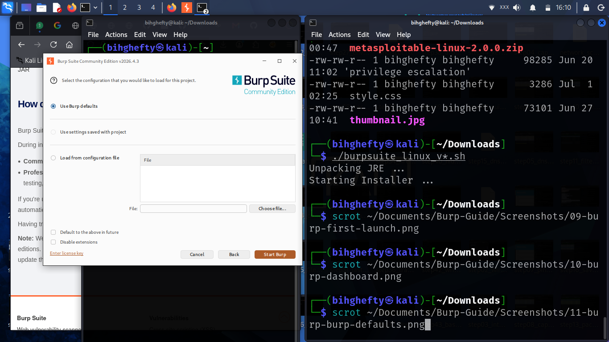

# Chapter 1

# Welcome to Your Burp Suite Journey

If you're reading this, you've already taken an important step.

You've decided to move beyond simply reading about cybersecurity and start learning by doing.

I'm genuinely excited for you because that's exactly how I began my own journey.

When I first heard about Burp Suite, I knew it was an important tool for web application security, but opening it for the first time was intimidating. There were tabs everywhere, panels I didn't understand, and features I had never heard of.

The good news is that you don't have to learn everything today.

We'll take it one step at a time.

By the end of this book, I want Burp Suite to feel like a tool you're comfortable using rather than something that seems complicated.

We're going to practise together, make mistakes together, and learn from every exercise.

That's how real cybersecurity skills are built.

---

## Why This Book Is Different

There are many books and videos that explain what Burp Suite can do.

My goal is different.

I want to show you how to use it.

Every chapter in this book is based on practical exercises that you can repeat in your own lab. Instead of rushing through features, we'll focus on understanding what each tool does, why it matters, and how you can apply it in real-world scenarios.

If something isn't clear the first time, that's perfectly fine.

Take your time.

Repeat the exercise.

The more you practise, the more confident you'll become.

---

## Figure 1.1 – Burp Suite Community Edition

*Figure 1.1: Burp Suite Community Edition showing the default interface after launching the application. Take a moment to become familiar with the layout and the main navigation tabs before we begin exploring each tool.*

Before clicking anything, spend a minute looking around the interface.

Notice the different tabs across the top of the window.

You don't need to understand them all right now.

Throughout this book, we'll explore each one together until they become familiar.

---

## Lessons I Learned

One of the biggest mistakes I made when I started learning cybersecurity was believing I had to understand everything immediately.

I quickly realised that wasn't true.

Progress came from opening the tools, trying things for myself, making mistakes, and learning from them.

Don't be afraid to experiment in your lab.

Some of your best learning moments will come from asking,

*"Why did that happen?"*

---

## Before We Continue

Make sure Burp Suite is installed and opens without any problems.

Don't worry if the interface looks unfamiliar.

By the time you finish this book, you'll know exactly what each major tool is used for.

We'll build that understanding together, one step at a time.

---

## A Final Thought

Cybersecurity isn't a race.

The people who succeed aren't always the ones who learn the fastest—they're the ones who keep learning.

So be patient with yourself.

Practise often.

Stay curious.

I'll be with you every step of the way.

See you in the next chapter.

— **Henry Uwaezuoke**

---

# Henry Uwaezuoke Cybersecurity Series

**Learn. Practice. Secure.**
