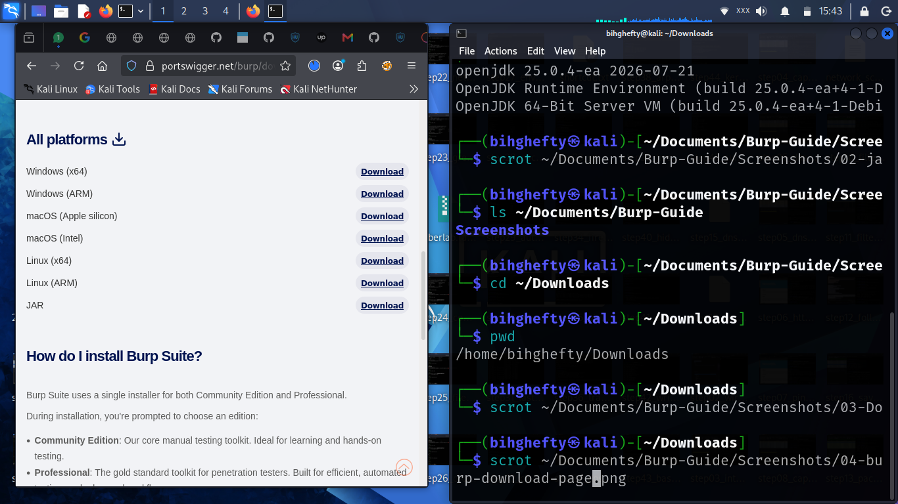

# Chapter 3

# Installing Burp Suite

Before we can explore Burp Suite, we need to get it running on our computer.

If you're new to cybersecurity, don't let this chapter make you nervous.

Installing Burp Suite is much easier than many people expect, and I'll guide you through the process one step at a time.

By the end of this chapter, you'll have Burp Suite installed and ready for the practical exercises that follow.

---

## Choosing the Right Edition

One of the first questions beginners ask is:

**"Which version of Burp Suite should I install?"**

For this book, we'll use **Burp Suite Community Edition**.

It's free, widely used, and contains everything you need to complete the practical exercises in this guide.

As your skills grow, you can always explore the Professional Edition, but there is no need to spend money while you're still building your foundation.

Learning the fundamentals is far more important than owning every feature.

---

## Downloading Burp Suite

Visit PortSwigger's official website and download the latest version of **Burp Suite Community Edition** for your operating system.

Always download security tools from their official source.

Doing so helps ensure you're using authentic software and receiving the latest updates.

---

## Figure 3.1 – Downloading Burp Suite Community Edition

*Figure 3.1: Download the latest Burp Suite Community Edition from the official PortSwigger website before beginning the installation.*

---

## Installing the Application

Run the installer and follow the installation steps for your operating system.

The default installation settings are suitable for most users, so there's usually no need to change them.

Once the installation is complete, launch Burp Suite.

The first launch may take a little longer than usual.

That's perfectly normal.

---

## Figure 3.2 – Burp Suite Installer

*Figure 3.2: Launch the installer and follow the setup wizard.*

---

## Lessons I Learned

The first time I installed Burp Suite, I spent more time worrying about whether I had installed it correctly than actually using it.

Looking back, I realised something important.

The best way to learn a tool isn't by staring at the installation screen—it's by opening the application and starting to explore.

Don't wait until you feel "ready."

Start learning now.

Confidence comes through practice.

---

## Before We Continue

Before moving to the next chapter, make sure:

- Burp Suite opens successfully.
- You can see the main interface.
- There are no installation errors.

If everything looks good, you're ready for the next step.

---

## A Final Thought

Every cybersecurity professional remembers the first tool they learned to use with confidence.

For many people, Burp Suite becomes one of those tools.

You're taking the first step today.

Keep going.

I'll be right here with you.

See you in the next chapter.

— **Henry Uwaezuoke**

---

# Henry Uwaezuoke Cybersecurity Series

**Learn. Practice. Secure.**
