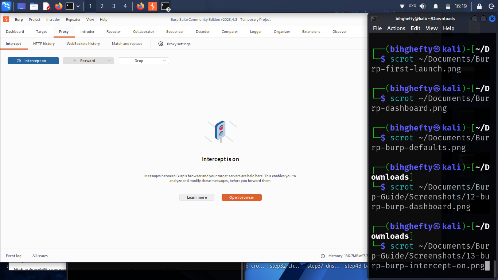

# Chapter 6

## Meeting the Proxy Tool

This is the chapter where Burp Suite truly starts to come alive.

Up to this point, we've prepared our lab, explored the interface, and learned how web applications communicate. Now it's time to begin using one of the most important features in Burp Suite.

The Proxy tool is the heart of Burp Suite.

Every request your browser sends and every response the server returns can pass through it. Once you understand how the Proxy works, the rest of Burp Suite becomes much easier to understand.

Let's take our first real look at it together.

---

## What Is the Proxy Tool?

Imagine sending a letter to a friend.

Normally, the letter goes directly from you to your friend.

Now imagine giving that letter to someone you trust before it is delivered.

That person can read it, check it, or even hand it back to you before sending it on.

That's exactly what the Proxy tool does.

Instead of allowing your browser to communicate directly with a web server, Burp Suite places itself in the middle so you can observe that conversation.

For anyone learning web application security, this is one of the most valuable things Burp Suite can do.

---

## Figure 6.1 – Burp Suite Proxy Tab

*Figure 6.1: The Proxy tab captures and displays HTTP requests between your browser and the target web application. This is the starting point for observing and analysing web traffic.*

---

## Why the Proxy Matters

Every time you:

- Open a webpage
- Submit a login form
- Search for information
- Upload a file

your browser sends a request to the server.

The server processes that request and sends a response back.

The Proxy allows you to watch that exchange happen.

Later, you'll even learn how to pause those requests before they reach the server.

---

## Lessons I Learned

When I first opened the Proxy tab, I expected something dramatic to happen.

Nothing did.

It took me a while to realise that the Proxy only becomes useful when your browser is actually sending traffic through Burp Suite.

That taught me an important lesson.

Security tools don't create activity on their own—they help you observe activity that's already happening.

Once I understood that, everything started to make sense.

---

## Stop and Think

Before moving on, ask yourself this question:

**If Burp Suite wasn't acting as a proxy, would it be able to see your browser's requests?**

The answer is **no**.

That's why configuring your browser to send traffic through Burp Suite is such an important step.

---

## Common Beginner Mistakes

When people first begin using Burp Suite, they often:

- Forget to configure Firefox to use Burp Suite.
- Expect requests to appear without browsing to a webpage.
- Think the Proxy is broken because no traffic appears.
- Become overwhelmed by the amount of information displayed.

If any of those happen to you, don't worry.

They're all part of the learning process.

---

## Before We Continue

Open Burp Suite.

Click the **Proxy** tab.

Spend a minute looking around.

You don't need to click every option.

Simply become familiar with where everything is.

In the next chapter, we'll take the next step by intercepting our very first request.

---

## Looking Ahead

The Proxy lets you observe web traffic.

The next chapter introduces the feature that gives you control over it.

We'll turn on **Intercept**, pause requests before they reach the server, and begin interacting with web applications in a completely new way.

Take your time.

The stronger your understanding of the Proxy, the easier the rest of Burp Suite will become.

I'll see you in the next chapter.

— **Henry Uwaezuoke**

---

### Henry Uwaezuoke Cybersecurity Series

**Learn. Practice. Secure.**

