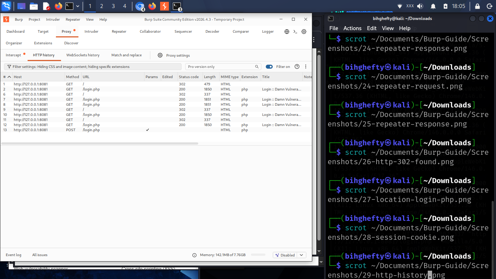
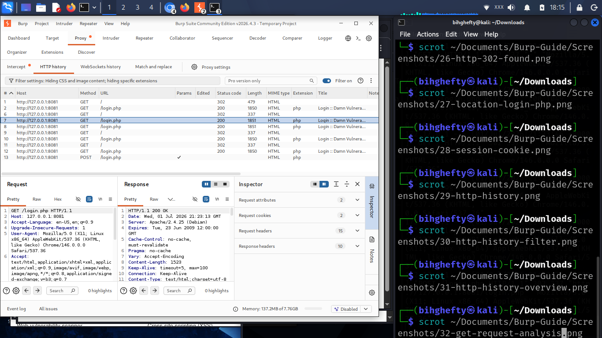

# Chapter 8

## Looking Back with HTTP History

Have you ever visited a website, clicked several pages, and then wished you could go back and see exactly what happened?

That's exactly what HTTP History helps you do.

When I first started using Burp Suite, I thought I had to intercept every request to learn something useful.

I was wrong.

Sometimes the best way to understand an application is to let it work normally, then review everything afterwards.

That's where HTTP History becomes one of your best friends.

Instead of stopping every request, it quietly records them for you.

Let's see how it works.

---

## What Is HTTP History?

Every time your browser communicates with a website through Burp Suite, the conversation can be recorded.

HTTP History is simply a list of those conversations.

Think of it as your browser's diary.

Every request.

Every response.

Every page you visited.

Everything stays there until you decide to review it.

This makes HTTP History incredibly useful when you're trying to understand how an application behaves.

---

## Figure 8.1 – HTTP History

*Figure 8.1: The HTTP History tab records every request and response that passes through Burp Suite, providing a complete view of your interaction with the target application.*

Take a minute to look at the list of requests.

Notice that each row represents one interaction between your browser and the server.

At first, it may look like a lot of information.

Don't worry.

We'll learn how to read it together.

---

## Let's Generate Some Traffic

Open Firefox.

Browse through DVWA.

Click several different pages.

Log in if necessary.

Open the **Instructions** page.

Return to Burp Suite.

Now click **Proxy → HTTP History**.

You should see multiple requests waiting for you.

Congratulations.

You've just captured your first browsing session.

---

## Figure 8.2 – Analysing a GET Request in HTTP History

*Figure 8.2: Selecting an entry from HTTP History allows you to inspect the complete HTTP request and response. This example shows a captured GET request, helping you understand how a browser communicates with a web application.*

Notice how every page you visited appears in the history.

This is one of the reasons HTTP History is so valuable.

Even if you didn't intercept a request, Burp Suite still remembers it.

---

## Lessons I Learned

When I first discovered HTTP History, I ignored it.

I thought Intercept was the only feature that mattered.

Later, while testing an application, I couldn't remember which page had submitted a request.

Instead of repeating the whole process, I opened HTTP History.

Everything I needed was already there.

That day taught me something simple.

Good security testing isn't only about capturing requests.

It's also about knowing how to find them again.

---

## Stop and Think

Imagine you're testing a website with twenty different pages.

Would it be easier to repeat every action...

or simply open HTTP History and review what Burp Suite has already recorded?

That's why experienced testers rely on HTTP History so often.

---

## Common Beginner Mistakes

Some beginners think HTTP History only records intercepted requests.

It doesn't.

Others clear the history too early and lose useful information.

My advice is simple.

Keep the history until you've finished your testing session.

You never know which request you'll need later.

---

## Before We Continue

Spend five minutes browsing DVWA.

Don't try to test anything yet.

Just explore.

Then come back to HTTP History and see how much information Burp Suite has collected.

The more traffic you generate, the more comfortable you'll become reading requests and responses.

---

## A Final Thought

One lesson I've learned over the years is that good testers don't rely on memory.

They rely on evidence.

HTTP History gives you that evidence.

It records your journey through an application and allows you to retrace your steps whenever you need to.

Get into the habit of checking it often.

Future you will be glad you did.

I'll see you in the next chapter.

— **Henry Uwaezuoke**

---

### Henry Uwaezuoke Cybersecurity Series

**Learn. Practice. Secure.**

