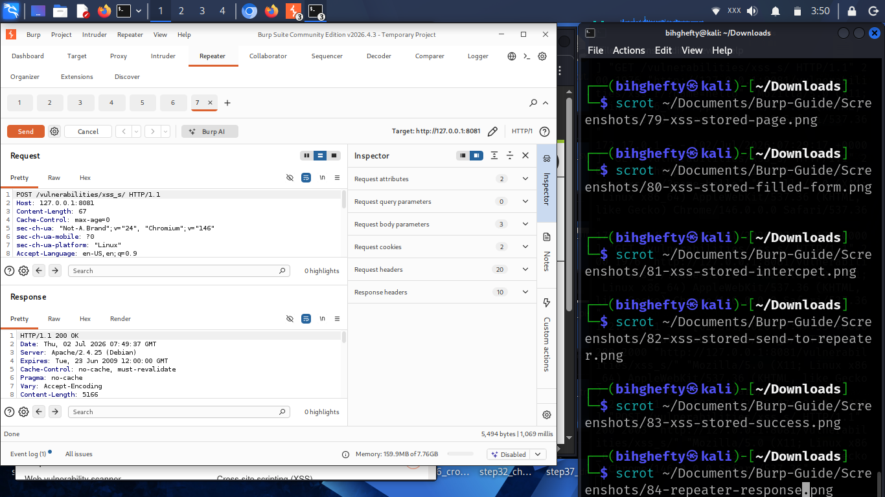
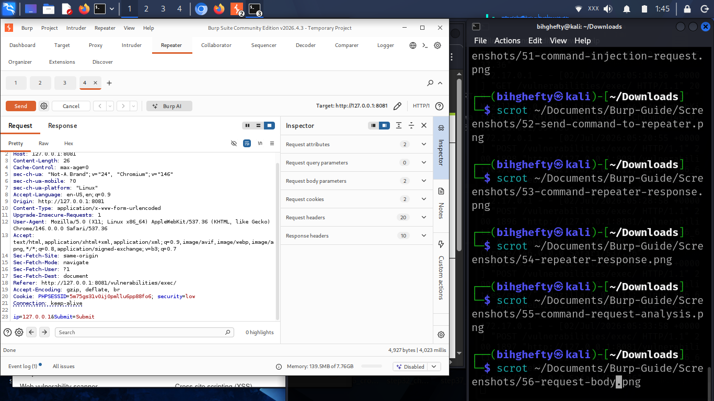

# Chapter 9

# Working Smarter with Repeater

One of the habits that helped me improve my web application testing was learning not to repeat the same actions in my browser over and over again.

At first, every time I wanted to test something different, I refreshed the page, filled in the form again, and submitted another request.

It worked, but it was slow.

Then I discovered Burp Suite's **Repeater** tool.

It completely changed the way I tested web applications.

Instead of sending the same request from my browser repeatedly, I could send it to Repeater once and experiment with it as many times as I wanted.

If the Proxy helps you capture requests, Repeater helps you study them.

---

## What Is Repeater?

Repeater is one of Burp Suite's most useful tools.

It allows you to resend the same HTTP request as many times as you like while making small changes between each attempt.

You stay in control.

You decide what to change.

You decide when to send the request.

That makes Repeater an excellent learning tool because you can immediately see how the server reacts to different inputs.

---

## Figure 9.1 – Sending a Request to Repeater

*Figure 9.1: After capturing a request in Burp Suite, you can send it to Repeater for manual testing. Repeater allows you to modify the request and resend it multiple times while observing how the server responds.*

Once you've captured a request in Proxy or HTTP History, right-click it and choose **Send to Repeater**.

The request will immediately appear in the Repeater tab.

---

## Exploring Your First Request

When you open Repeater, you'll notice that the request is displayed exactly as Burp Suite captured it.

Nothing has changed.

That's intentional.

Repeater gives you a safe place to experiment without needing to browse back through the application each time.

Take a few moments to read the request.

Notice the method, the URL, the headers, and any parameters.

The more familiar these become, the more comfortable you'll feel analysing web traffic.

---

## Figure 9.2 – Repeater Interface

*Figure 9.2: The Repeater interface displays the complete HTTP request alongside the corresponding server response. You can edit headers, parameters, or the request body before sending the request again to observe how the application responds.*

One of the things I appreciate most about Repeater is that it displays the request and the response side by side.

That makes it much easier to understand how even a small change affects the application's behaviour.

---

## Lessons I Learned

The first time I used Repeater, I kept changing several things at once.

When the server responded differently, I had no idea which change caused it.

Eventually I learned a better approach.

Change **one thing at a time**.

Send the request.

Study the response.

Then make another small change.

That simple habit taught me far more than changing everything at once.

---

## Stop and Think

Imagine you're testing a login request.

Would you rather:

- Capture the request every single time from your browser?

or

- Capture it once and use Repeater to test different values?

Most security professionals choose Repeater because it saves time and keeps testing organised.

---

## Common Beginner Mistakes

When learning Repeater, it's common to:

- Modify too many values at once.
- Forget to click **Send** after editing the request.
- Focus only on the request and ignore the server's response.
- Rush through testing instead of observing carefully.

Remember, Repeater is about understanding, not speed.

---

## Before We Continue

Choose one request from DVWA.

Send it to Repeater.

Change one small value.

Click **Send**.

Compare the response with the original.

Repeat the process a few times.

You'll quickly begin to see how web applications react to different inputs.

---

## Looking Ahead

You've now captured requests, reviewed them in HTTP History, and replayed them using Repeater.

Next, we'll explore how Burp Suite can automate repetitive testing with **Intruder**.

As always, don't rush.

The goal isn't to finish the book quickly.

The goal is to understand every chapter well enough that you can apply it confidently in your own lab.

I'll see you in the next chapter.

— **Henry Uwaezuoke**

---

# Henry Uwaezuoke Cybersecurity Series

**Learn. Practice. Secure.**

