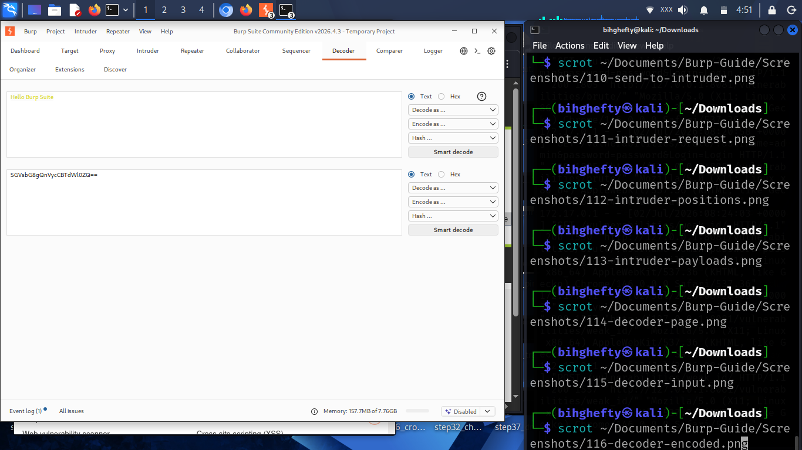

# Chapter 11

# Making Sense of Encoded Data with Decoder

As I spent more time analysing HTTP requests, I began noticing something interesting.

Not everything I saw was easy to read.

Sometimes a value looked like random letters, numbers, or strange symbols.

At first, I assumed something was wrong.

Later, I discovered that the information wasn't broken.

It was simply **encoded**.

That's when I started using Burp Suite's Decoder.

Decoder is one of those tools that quietly solves problems you'll encounter again and again during web application testing.

Once you learn how it works, you'll wonder how you managed without it.

---

## What Is Decoder?

Decoder is a tool that helps you convert data from one format into another.

For example, you might come across information that's encoded using Base64, URL encoding, or another common format.

Instead of guessing what it means, Burp Suite can help you decode it into something you can read.

It can also perform the reverse operation by encoding data before you send it.

Understanding what's happening is far more important than memorising the different encoding formats.

---

## Figure 11.1 – Decoder Tool

*Figure 11.1: The Decoder tool allows you to paste encoded or decoded data for analysis. It supports multiple encoding formats, making it useful when examining web requests, cookies, parameters, and other application data.*

Spend a minute looking around the Decoder interface.

Notice how simple it is compared to some of the other Burp Suite tools.

Sometimes the simplest tools become the most useful.

---

## Your First Decode

Copy a piece of encoded text.

Paste it into Decoder.

Select the appropriate decoding option.

Watch the output change.

The first time you do this, it almost feels like solving a puzzle.

That's one of the reasons I enjoy using Decoder.

It takes information that looks confusing and makes it understandable.

---

## Figure 11.2 – Decoding Base64 Data

*Figure 11.2: Burp Suite Decoder converts Base64-encoded data into its original readable form. This helps you understand how applications encode information and inspect values that would otherwise be difficult to interpret.*

Notice how the output immediately becomes easier to understand.

That's exactly what Decoder is designed to do.

---

## Lessons I Learned

When I first started learning web application security, I spent far too much time trying to understand encoded values by looking at them.

Eventually I realised I didn't have to guess.

Good security professionals use the right tools.

Decoder quickly became one of those tools I reached for whenever something didn't look familiar.

One lesson stayed with me:

**If you don't understand the data, don't ignore it.**

**Decode it.**

---

## Stop and Think

Imagine receiving a message written in a language you don't understand.

Would you throw it away?

Or would you translate it first?

That's exactly what Decoder helps you do.

It translates information into a format that's easier to understand.

---

## Common Beginner Mistakes

Many beginners assume that encoded data is encrypted.

It usually isn't.

Encoding and encryption are two very different things.

Another common mistake is trying every decoding option without first thinking about what kind of data they're looking at.

Take a moment to observe before experimenting.

Understanding always comes before automation.

---

## Before We Continue

Open Decoder.

Paste a few sample values into it.

Try different encoding and decoding options.

Don't worry about memorising every format today.

The goal is simply to become comfortable using the tool.

---

## Looking Ahead

So far you've learned how to capture requests, replay them, automate repetitive tasks, and decode data.

Next, we'll explore another useful Burp Suite tool called **Comparer**, which helps you identify differences between requests and responses.

Small details often make a big difference in cybersecurity.

Comparer helps you find them.

I'll see you in the next chapter.

— **Henry Uwaezuoke**

---

# Henry Uwaezuoke Cybersecurity Series

**Learn. Practice. Secure.**

