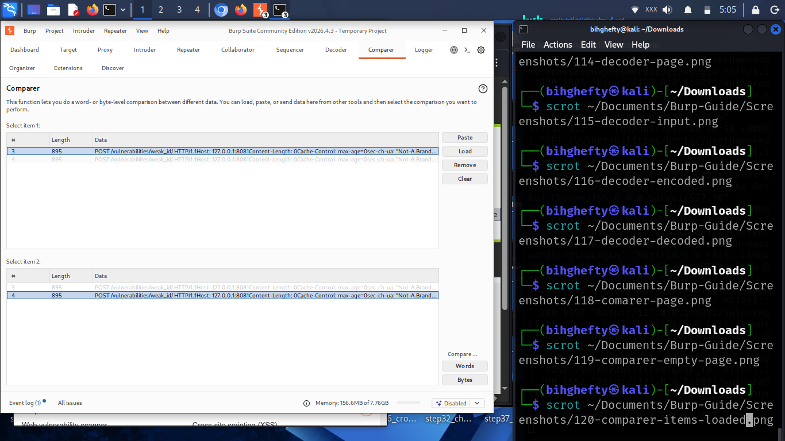
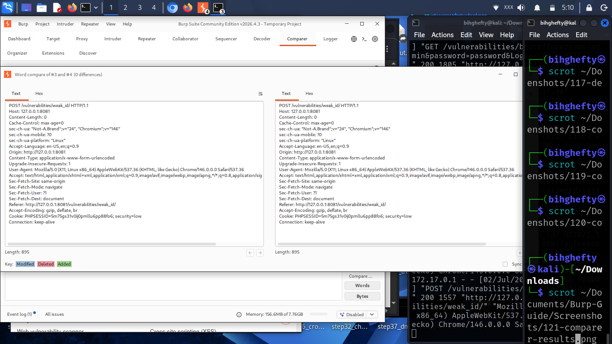

# Chapter 12

# Spotting Small Differences with Comparer

One lesson cybersecurity has taught me is that the smallest difference can sometimes explain the biggest problem.

Two requests may look almost identical.

Two responses may appear the same at first glance.

But hidden somewhere inside could be a small change that completely changes how an application behaves.

Trying to find those differences by reading line after line can be frustrating.

That's where Burp Suite's **Comparer** becomes incredibly useful.

Instead of searching manually, Comparer highlights the differences for you.

---

## What Is Comparer?

Comparer is a Burp Suite tool that compares two pieces of information.

Those could be:

- Two HTTP requests.
- Two HTTP responses.
- Two cookies.
- Two encoded values.
- Or any other text you want to compare.

Rather than making you read everything line by line, Burp Suite highlights exactly where the differences appear.

That makes your job much easier.

---

## Figure 12.1 – Sending Items to Comparer

*Figure 12.1: Burp Suite Comparer allows you to load two or more requests or responses for comparison. This is useful when identifying subtle differences in application behaviour that might otherwise be difficult to notice.*

Choose two requests from HTTP History.

Right-click each one and send them to Comparer.

We'll compare them together.

---

## Reading the Results

Once both items are loaded, Burp Suite displays them side by side.

Immediately your eyes are drawn to the highlighted differences.

Those highlights save time.

Instead of asking,

*"What changed?"*

you can immediately begin asking,

*"Why did it change?"*

That's the question that helps you understand how an application works.

---

## Figure 12.2 – Comparer Results

*Figure 12.2: Comparer highlights the differences between the selected items, making it easier to identify changes that might be difficult to notice during manual inspection.*

Spend a few minutes studying the highlighted areas.

Even small differences can tell an important story.

---

## Lessons I Learned

I used to compare requests by opening two windows and reading them one line at a time.

It wasn't impossible.

It was simply inefficient.

The first time I used Comparer, I realised Burp Suite could do that work much faster than I could.

That experience reminded me of something I still believe today:

A good cybersecurity professional doesn't avoid hard work.

They learn to use good tools wisely.

---

## Stop and Think

Imagine receiving two login requests.

One succeeds.

The other fails.

Wouldn't it be helpful if Burp Suite immediately showed you the exact differences?

That's exactly why Comparer exists.

---

## Common Beginner Mistakes

Many beginners overlook Comparer because it looks simple.

Don't make that mistake.

Simple tools often solve frustrating problems.

Another common mistake is comparing completely unrelated requests.

Start by comparing similar requests.

The differences will make much more sense.

---

## Before We Continue

Open HTTP History.

Choose two similar requests.

Send both to Comparer.

Spend a few minutes examining the highlighted differences.

Ask yourself what changed and why.

Curiosity is one of your greatest tools.

---

## Looking Ahead

You've now explored many of Burp Suite's core tools.

In the next chapter, we'll look at the **Target** tab and learn how Burp Suite organises the applications you're testing.

By now you may have noticed something.

Every Burp Suite tool has a different purpose, but they all work together.

The more you practise, the more natural that workflow will become.

I'll see you in the next chapter.

— **Henry Uwaezuoke**

---

# Henry Uwaezuoke Cybersecurity Series

**Learn. Practice. Secure.**

