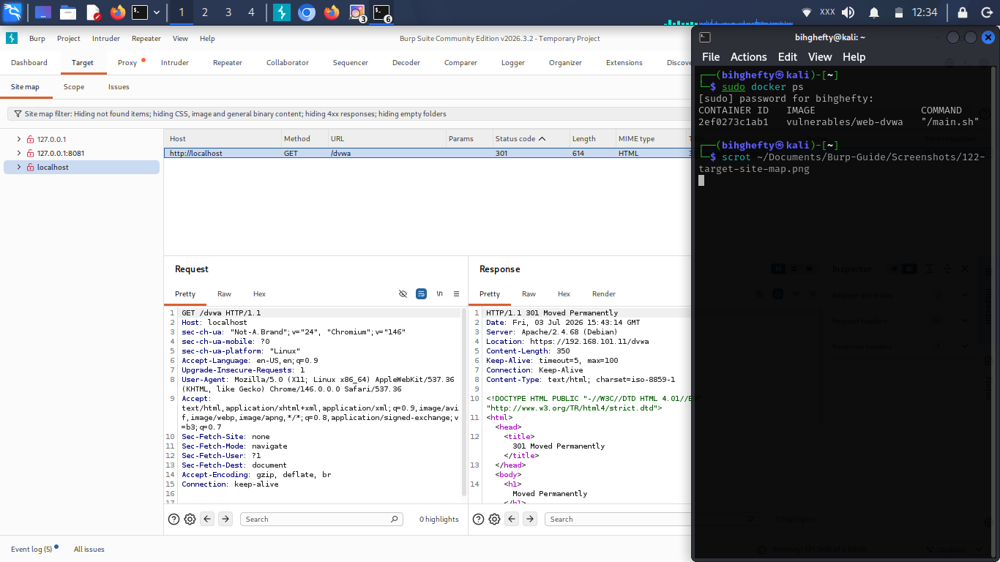
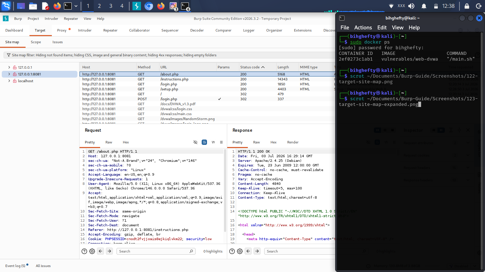

# Chapter 13

**Seeing the Bigger Picture with the Target Tab**

As I became more comfortable using Burp Suite, I noticed something.

The more pages I visited, the more requests I captured.

After a while, I wasn't just looking at individual requests anymore.

I wanted to understand the entire application.

Which pages existed?

Which folders were available?

How were they connected?

That's exactly what the **Target** tab helped me understand.

Instead of looking at one request at a time, I could step back and see the application's structure as a whole.

Sometimes that's exactly what you need.

---

**What Is the Target Tab?**

The Target tab gives you an organised view of the application you're exploring.

Rather than displaying isolated requests, it groups resources together so you can understand how the application is arranged.

Think of it as looking at the table of contents of a book instead of reading one page at a time.

Both are useful.

They simply answer different questions.

---

*Figure 13.1: Burp Suite's Target → Site map showing the discovered hosts after browsing the application. At this stage, Burp Suite has identified multiple hosts, allowing you to organise and navigate the application's structure from a central location.*

---

Spend a few moments looking through the folders and pages.

Even if you don't recognise everything yet, you're beginning to see how Burp Suite organises information.

---

**Why It Matters**

Imagine you're testing a website with dozens of pages.

Without organisation, finding a specific request could quickly become frustrating.

The Target tab solves that problem by grouping related resources together.

As your testing sessions become larger, you'll appreciate having everything organised in one place.

Good organisation saves time.

---

*Figure 13.2: An expanded view of the Target → Site map displaying the pages and resources discovered under the selected host. Expanding the Site Map helps you understand how the application is organised and makes it easier to locate specific pages during testing.*

---

Notice how expanding the folders reveals additional pages and resources.

This gives you a clearer understanding of how the application is structured and helps you navigate larger web applications more efficiently.

---

**Lessons I Learned**

When I first discovered the Target tab, I didn't pay much attention to it.

I was too focused on Proxy and Repeater.

Later, while reviewing a larger practice application, I realised I had forgotten where I had found a particular page.

The Target tab helped me locate it in seconds.

That experience taught me an important lesson.

The better organised your tools are, the more organised your testing becomes.

---

**Stop and Think**

Imagine trying to explore a large shopping mall without a directory.

You'd eventually find what you're looking for...

but it would take much longer.

The Target tab is that directory.

It helps you understand where everything belongs.

---

**Common Beginner Mistakes**

As you begin using the Target tab, remember these tips:

- Don't assume every folder contains important functionality.
- Take time to explore the application's structure before rushing into testing.
- Use the Site Map as a guide rather than a shortcut.
- Remember that discovering a page doesn't automatically mean it's vulnerable.

Understanding the application is one of the most valuable parts of any security assessment.

---

**Before We Continue**

Browse around DVWA for a few minutes.

Then return to the Target tab.

Expand the folders.

Click through different sections.

Try to identify how the application is organised.

Don't worry about memorising everything.

Simply become familiar with the layout.

---

**Looking Ahead**

You've now explored the core tools that make Burp Suite such a powerful platform.

In the next chapter, we'll begin putting these tools together in practical DVWA exercises.

That's where everything you've learned starts working together.

Take your time.

The goal isn't simply to know the tools.

The goal is to understand when and why to use them.

I'll see you in the next chapter.

— **Henry Uwaezuoke**

