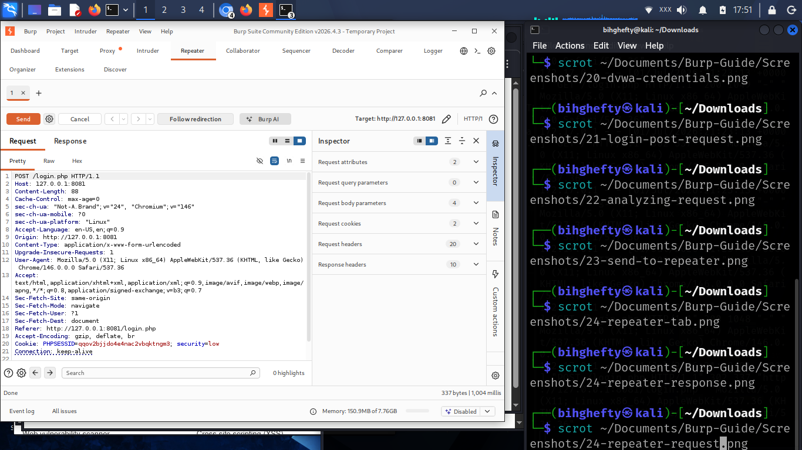

# Chapter 14

# Your First Complete Burp Suite Lab

Congratulations.

This is the chapter where everything you've learned finally comes together.

Up to this point, we've explored Burp Suite one tool at a time.

Now we're going to use those tools together during a simple practice session in DVWA.

Don't think of this as an exam.

Think of it as your first complete walkthrough.

I'll guide you through each step.

---

## Our Goal

During this exercise, you'll:

• Browse DVWA.

• Capture requests.

• Review HTTP History.

• Send a request to Repeater.

• Compare responses when necessary.

• Observe how Burp Suite helps you understand what your browser is doing.

Notice something important.

We're not attacking anything.

We're learning.

Professional cybersecurity always begins with understanding.

---

## Step 1 — Open DVWA

Launch DVWA in Firefox.

Log in using your lab credentials.

Browse to a few different pages.

Don't rush.

Simply explore.

---

## Figure 14.1 – DVWA Home Page

*Figure 14.1: DVWA ready for testing. Before beginning the practical lab, verify that the application is running and that you can successfully log in using the provided credentials.*

---

## Step 2 — Watch HTTP History Grow

Return to Burp Suite.

Open:

Proxy → HTTP History

You'll immediately notice something.

Every page you visited has been recorded.

Without doing anything extra, Burp Suite has already documented your browsing session.

That's one of its greatest strengths.

---

## Figure 14.2 – HTTP History After Browsing

*Figure 14.2: After browsing DVWA, Burp Suite captures the application's HTTP traffic. From HTTP History, individual requests can be reviewed and sent to other tools such as Repeater for further analysis.*

---

## Step 3 — Send a Request to Repeater

Choose one request.

Right-click it.

Select:

**Send to Repeater**

Open the Repeater tab.

Read the request carefully.

Don't edit anything yet.

Learning to observe is just as important as learning to modify.

---

## Figure 14.3 – Request in Repeater

*Figure 14.3: The selected request has been sent to Repeater, where it can be modified and resent multiple times. This allows you to safely test how the application responds to different inputs without repeatedly interacting with the browser.*

---

## Step 4 — Make One Small Change

Now change only one value.

Maybe a parameter.

Maybe a search term.

Maybe part of the URL.

Click **Send**.

Now compare the response.

Did anything change?

If it did...

Ask yourself why.

That's how security professionals think.

---

## Lessons I Learned

One mistake I made as a beginner was trying to do everything at once.

I'd intercept requests...

edit them...

run Intruder...

check Decoder...

all within a few minutes.

I learned very little because I was moving too quickly.

Eventually I slowed down.

One request.

One observation.

One lesson.

Ironically, slowing down made me learn much faster.

---

## Stop and Think

Close Burp Suite for a moment.

Now ask yourself:

Without Burp Suite...

Would I have known exactly what my browser was sending?

Probably not.

That's why Burp Suite is such an important learning tool.

It reveals conversations that normally stay hidden.

---

## Common Beginner Mistakes

During this lab, beginners often:

• Click too quickly.

• Ignore the server response.

• Forget which request they're analysing.

• Try multiple tools at the same time.

My advice?

Slow down.

Understand one request completely before moving to the next.

---

## Lab Challenge

Repeat this exercise again tomorrow.

Then repeat it next week.

Each time, you'll notice details you missed before.

That's how practical cybersecurity skills develop.

Not through memorisation...

Through repetition.

---

## Looking Ahead

You've now completed your first complete Burp Suite workflow.

From this point onward, every new feature you learn will build on this foundation.

Take a moment to appreciate how far you've come.

The Burp Suite interface probably feels much less intimidating now than it did when you opened it for the first time.

That's progress.

I'll see you in the next chapter.

— **Henry Uwaezuoke**

---

# Henry Uwaezuoke Cybersecurity Series

**Learn. Practice. Secure.**
