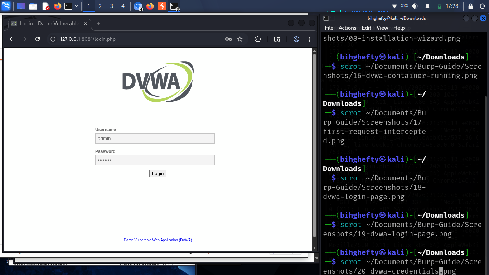
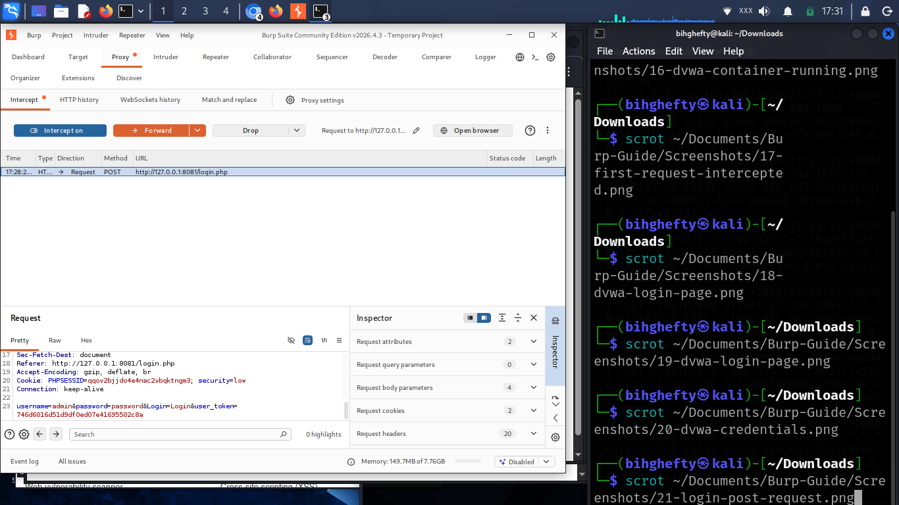

# Chapter 16

**Every Login Tells a Story**

There was a time when a login page looked ordinary to me.

I would type my username.

Enter my password.

Click **Login**.

If the page opened, I moved on without giving it another thought.

Burp Suite completely changed the way I looked at that simple process.

One afternoon, while practising in DVWA, I intercepted a login request for the first time.

For a few seconds, I just stared at it.

There it was...

My browser wasn't performing magic.

It was simply sending an HTTP request to the server.

For the first time, I wasn't looking at a login page.

I was looking at a conversation.

That moment changed the way I understood web applications.

Today, whenever I visit a login page, I don't just see boxes asking for a username and password.

I see data moving between a browser and a web server.

And that's exactly what I want you to see after reading this chapter.

---

**What You'll Learn**

By the end of this chapter, you'll be able to:

- Capture a login request.
- Identify the important parts of the request.
- Understand what your browser sends to the server.
- Read login traffic with confidence.

Don't worry if some of the request looks unfamiliar.

We're learning together, one step at a time.

---

**Before We Touch Burp Suite**

Here's something I wish someone had told me when I was learning.

Don't start by looking for vulnerabilities.

Start by understanding normal behaviour.

If you know what a normal login request looks like, unusual behaviour becomes much easier to recognise later.

That simple habit has helped me countless times.

---

*The DVWA login page before authentication. This is where users enter their credentials before Burp Suite captures the HTTP POST request sent to the server.*

---

Before clicking **Login**, pause for a moment.

Ask yourself:

*"What do I think my browser is about to send?"*

Even if your answer isn't perfect, asking the question will help you think more like a security professional.

---

**Capturing the Request**

Turn **Intercept** on.

Enter your username and password.

Click **Login**.

Burp Suite will stop the request before it reaches the server.

Take a slow look at it.

There's no need to rush.

Every line has a purpose.

---

*Burp Suite intercepts the HTTP POST login request before it reaches the server. The request includes the submitted form data, HTTP headers, cookies, and other information exchanged during authentication.*

---

This is one of the most important screenshots you've seen so far.

Spend a few minutes studying it.

You don't need to understand every header today.

Focus on the bigger picture.

Your browser is having a conversation with the server.

Burp Suite simply allows you to watch that conversation.

---

**From My Lab**

One evening I spent almost fifteen minutes trying to understand why a request looked different from the previous one.

I checked the parameters.

I checked the cookies.

I checked the headers.

Eventually, I realised the only difference was that I had logged out and logged back in again.

The application had issued a new session cookie.

That experience taught me something simple.

Before looking for complicated explanations, always check the basics.

Small details often explain big differences.

---

**Henry's Pro Tip**

When you're learning Burp Suite, don't ask:

*"How do I hack this?"*

Ask:

*"What is this application doing?"*

Curiosity will always take you further than impatience.

The better you understand normal behaviour, the easier it becomes to recognise something unusual later.

---

**Stop and Think**

Close your eyes for a moment.

Imagine your browser writing a letter to the server.

What information would that letter contain?

Now open the intercepted request again.

That's the letter.

You're reading that conversation for yourself.

---

**Common Beginner Mistakes**

One mistake I made early on was trying to understand every header in one sitting.

It was overwhelming.

Eventually, I realised I didn't need to learn everything at once.

I focused on the request line.

Then the parameters.

Then the headers.

Little by little, everything started making sense.

Learning cybersecurity is a marathon, not a sprint.

Take your time.

Progress comes from consistency, not speed.

---

**Lab Challenge**

Repeat this exercise three times.

Each time, write down one thing you noticed that you didn't notice before.

It could be:

- A new header.
- A cookie.
- A parameter.
- Or even the order in which the information appears.

You'll be surprised how much your observation skills improve after just a few practice sessions.

---

**Before You Close Burp Suite**

Take one last look at the login request.

Don't analyse it.

Don't modify it.

Just read it.

Become familiar with it.

The more comfortable you become reading HTTP requests, the more confident you'll become as a cybersecurity professional.

Every expert started exactly where you are today—learning to understand one request at a time.

— **Henry Uwaezuoke**

