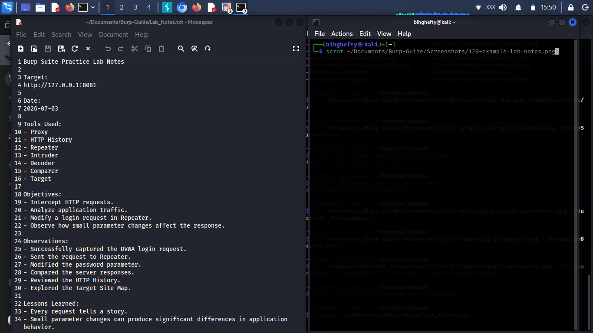

# Chapter 18

**The Habits That Made Me Better**

People sometimes ask me how I became comfortable using Burp Suite.

They're usually expecting me to mention a special course, an expensive certification, or a secret technique.

My answer often surprises them.

It wasn't one big breakthrough.

It was a collection of small habits that I practised every time I opened my lab.

I learned to slow down.

I learned to take notes.

I learned to ask questions before searching for answers.

Most importantly, I learned that becoming better at cybersecurity isn't about knowing everything.

It's about improving a little every day.

Looking back now, I realise those habits helped me far more than any single Burp Suite feature ever did.

That's what I want to share with you in this chapter.

Not shortcuts.

Not secret techniques.

Just the habits that genuinely helped me become a better cybersecurity learner.

---

**What You'll Learn**

By the end of this chapter, you'll understand:

- Why consistency beats intensity.
- How small habits improve your technical skills.
- Why observation is one of a cybersecurity professional's greatest strengths.
- Practical habits you can begin using in your own lab today.

---

**Habit 1: Never Rush Through a Request**

When I first started practising, I thought sending more requests meant I was learning faster.

I couldn't have been more wrong.

Eventually, I realised I learned far more from studying one request carefully than from sending twenty requests without understanding them.

Today, I still pause before clicking **Send**.

I ask myself:

*"What do I expect the application to do?"*

That simple question keeps me focused.

---

**Habit 2: Keep Notes**

One of the best decisions I ever made was keeping a notebook beside my computer.

Whenever I discovered something new, I wrote it down.

Not because I would forget immediately.

Because writing helped me understand it better.

Even today, I still keep notes during practice sessions.

Your future self will thank you for doing the same.

---

*Keeping organised notes during your Burp Suite practice sessions helps you record observations, testing steps, and important findings. Good documentation makes it easier to review your progress, repeat successful techniques, and continue improving over time.*

---

**Habit 3: Be Curious**

Curiosity has taught me more than any tool.

Whenever I see something unfamiliar, I don't immediately search for the answer.

First, I ask myself:

*"Why might the application behave this way?"*

Sometimes I'm wrong.

That's okay.

Trying to reason through the problem helps me grow.

Over time, you'll discover that asking good questions is often more valuable than finding quick answers.

---

**From My Lab**

One evening, I spent almost half an hour reading the same HTTP request.

I wasn't testing anything.

I wasn't looking for vulnerabilities.

I was simply trying to understand every line.

At first, it felt slow.

Later, I realised that half hour had taught me more than several rushed practice sessions.

That experience reminded me that understanding always comes before speed.

---

**Henry's Pro Tip**

Don't compare your beginning with someone else's experience.

Every cybersecurity professional started by learning one concept at a time.

Focus on steady progress.

That's what builds confidence.

---

**Stop and Think**

Imagine practising for thirty minutes every day for the next six months.

How much would you improve?

Now imagine waiting for the "perfect time" to start.

Small, consistent effort almost always wins.

---

**Common Beginner Mistakes**

As you continue learning, try to avoid these habits:

- Practising only when you feel motivated.
- Skipping the basics because they seem too simple.
- Copying commands without understanding them.
- Measuring progress by speed instead of understanding.

Remember, confidence grows from understanding, not from rushing.

---

**Lab Challenge**

During your next practice session:

1. Capture one request.
2. Read every line before making any changes.
3. Write down three observations.
4. Modify only one value.
5. Compare the response.

Repeat this exercise until careful observation becomes a habit.

---

**Before You Close Burp Suite**

Before ending today's session, ask yourself one simple question:

**"What did I understand today that I didn't understand yesterday?"**

If you can answer that question, you've made progress.

Progress isn't measured by how much time you spend in Burp Suite.

It's measured by how much you learn while you're there.

---

**Looking Ahead**

The habits you've built so far will help you far beyond Burp Suite.

In the next chapter, we'll learn one of the most valuable skills in web application security—how to read between the lines.

You'll discover that understanding an application's behaviour often depends not only on what you see, but also on what you don't see.

Sometimes the smallest detail reveals the biggest lesson.

— **Henry Uwaezuoke**

