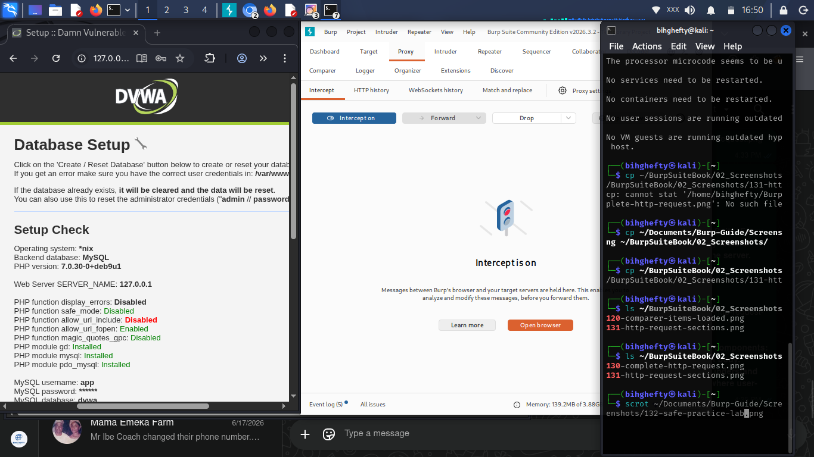

# Chapter 20

> **"The best place to make mistakes is in a lab you built for learning."**
>
> — **Henry Uwaezuoke**

**Building a Safe Practice Lab**

One of the questions I receive most often from beginners is:

*"Where can I practise without getting into trouble?"*

I understand why that question comes up.

When you're excited to learn cybersecurity, it's tempting to point your tools at every website you visit.

I had that excitement too.

Thankfully, I learned an important lesson very early in my journey.

Good cybersecurity professionals don't practise wherever they can.

They practise where they have permission.

That simple principle has guided me throughout my career, and it's one I hope you'll carry with you from the very beginning.

Your lab is more than a collection of virtual machines.

It's your classroom.

It's your workshop.

It's the place where you're free to make mistakes, repeat exercises, and build confidence without worrying about affecting someone else's systems.

If you develop the habit of practising safely today, you'll carry that professionalism into every stage of your cybersecurity career.

---

**What You'll Learn**

By the end of this chapter, you'll be able to:

- Understand why a practice lab is essential.
- Identify safe environments for learning Burp Suite.
- Appreciate the importance of permission in cybersecurity.
- Build habits that prepare you for real-world work.

---

**Why Every Cybersecurity Student Needs a Lab**

Imagine trying to learn to drive without a safe place to practise.

It would be stressful.

You'd spend more time worrying about making mistakes than actually learning.

Cybersecurity is no different.

Your lab gives you the freedom to explore, experiment, and make mistakes in an environment designed for learning.

When you know you're working safely, you're more willing to ask questions, try new ideas, and build confidence.

That's where real learning begins.

---

*Figure 20.1: A safe practice environment consisting of Kali Linux, Burp Suite, and DVWA running locally. Using an isolated lab allows you to practise web application security safely without affecting production systems.*

---

Don't worry if your setup doesn't look exactly like this.

A simple lab that you use consistently is far more valuable than an advanced setup that you rarely open.

---

**Safe Places to Practise**

As your skills grow, you'll discover many excellent platforms designed specifically for learning.

Some of the environments I recommend are:

- DVWA (Damn Vulnerable Web Application)
- OWASP Juice Shop
- PortSwigger Web Security Academy
- Metasploitable

These platforms were created to help people learn safely.

Take advantage of them.

The more time you spend practising in authorised environments, the more confident you'll become.

---

**From My Lab**

I still remember building my first practice lab.

Nothing worked perfectly.

One day the virtual machine refused to boot.

Another day Burp Suite couldn't connect to my browser.

At the time, those problems felt frustrating.

Looking back, I realise I wasn't just learning Burp Suite.

I was learning patience.

I was learning troubleshooting.

I was learning persistence.

Sometimes the biggest lesson isn't in the exercise itself.

Sometimes it's in solving the problem that stopped you from doing the exercise.

— **Henry Uwaezuoke**

---

**Henry's Pro Tip**

Don't wait until your lab is perfect before you begin practising.

Start with what you have.

Improve your lab as your skills improve.

Learning and building can happen at the same time.

---

**Stop and Think**

Ask yourself this question:

**"If I spend just thirty minutes practising every day for the next six months, where could I be?"**

Never underestimate consistent effort.

Small improvements, repeated over time, create remarkable results.

---

**Common Beginner Mistakes**

Avoid these habits:

- Practising on systems without permission.
- Believing expensive equipment is required to learn.
- Giving up when something doesn't work the first time.
- Spending more time collecting tools than learning how to use them.

Your mindset matters far more than your setup.

---

**Lab Challenge**

Before your next study session:

- Start your practice lab.
- Open DVWA.
- Launch Burp Suite.
- Capture one request.
- Write down one new thing you noticed.

Repeat this exercise every time you practise.

Consistency will become one of your greatest strengths.

---

**Before You Close Burp Suite**

Before ending today's session, take a moment to appreciate your progress.

The lab you're building today is preparing you for the work you'll do tomorrow.

Every request you intercept.

Every response you analyse.

Every mistake you fix.

Every lesson you learn.

They're all helping you become a better cybersecurity professional.

Keep learning.

Keep practising.

Keep building.

---

**A Final Thought**

The cybersecurity professionals you admire didn't begin with perfect labs or unlimited knowledge.

They started exactly where you are now—with curiosity, patience, and a willingness to keep learning.

Your lab is more than software running on a computer.

It's where confidence is built.

It's where experience begins.

And one day, you'll look back and realise that the hours you spent practising here became the foundation of your career.

— **Henry Uwaezuoke**

