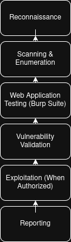

# Chapter 22

> **"A tool doesn't make someone an ethical hacker. Character does."**
>
> — **Henry Uwaezuoke**

**Where Burp Suite Fits into Ethical Hacking**

One of the biggest misconceptions I hear from beginners is this:

*"If I learn Burp Suite, I'll become an ethical hacker."*

I understand why people think that.

Burp Suite is one of the most powerful tools used by penetration testers around the world.

But over the years, I've learned something important.

**Tools don't create professionals. People do.**

Learning how to intercept requests is valuable.

Understanding how web applications work is valuable.

But what truly separates a good ethical hacker is the ability to think carefully, act responsibly, and keep learning.

Burp Suite is one of the tools you'll carry in your toolbox.

It isn't the toolbox itself.

As your cybersecurity journey continues, you'll learn networking, Linux, programming, operating systems, cloud security, and many other skills.

That's why I always encourage beginners to see Burp Suite as a foundation rather than a destination.

---

**What You'll Learn**

By the end of this chapter, you'll understand:

- Where Burp Suite fits within ethical hacking.
- Why technical skills alone aren't enough.
- The importance of ethics and permission.
- The other skills every penetration tester should develop.

---

**Burp Suite Is Part of the Journey**

Imagine a carpenter.

Owning a hammer doesn't make someone a master carpenter.

Learning when and how to use it does.

Burp Suite works the same way.

It helps you inspect, analyse, and test web applications.

But successful ethical hacking also requires knowledge of:

- Linux
- Networking
- HTTP and HTTPS
- Programming fundamentals
- Operating systems
- Web technologies
- Report writing
- Communication skills

The more these skills grow together, the more effective you become.

---

*Burp Suite is one component of the ethical hacking workflow. It is primarily used during web application testing to intercept, inspect, modify, and analyse HTTP requests and responses while working alongside other essential cybersecurity skills.*

---

**Ethics Always Comes First**

One lesson I hope every reader remembers is this:

**Permission matters.**

No matter how skilled you become, testing systems without authorisation is wrong.

Professional cybersecurity is built on trust.

Clients trust you to protect their systems.

Employers trust you to act responsibly.

That trust is earned through both technical ability and personal integrity.

Never sacrifice one for the other.

---

**From My Lab**

As I continued learning, I realised something that changed my perspective.

Every new tool I learned made me appreciate the previous one even more.

Networking helped me understand Burp Suite.

Linux helped me troubleshoot problems faster.

Learning HTTP made intercepted requests much easier to read.

It reminded me that cybersecurity isn't about mastering one tool.

It's about connecting many different skills together.

— **Henry Uwaezuoke**

---

**Henry's Pro Tip**

Don't measure your progress by the number of tools you've installed.

Measure it by how well you understand the ones you already use.

Depth will always serve you better than collecting tools you barely know.

---

**Stop and Think**

Imagine someone gives you every cybersecurity tool available today.

Would that automatically make you an expert?

Of course not.

Knowledge grows through study.

Skill grows through practice.

Wisdom grows through experience.

---

**Common Beginner Mistakes**

Some beginners believe:

- Learning one tool is enough.
- Expensive tools create better hackers.
- Technical skills are more important than ethics.
- More tools always mean more knowledge.

Avoid these misunderstandings.

The best cybersecurity professionals never stop learning.

---

**Lab Challenge**

Create a learning roadmap for yourself.

Write down three cybersecurity skills you want to improve after finishing this book.

For example:

- Linux
- Networking
- Python
- OWASP Top 10
- Web application testing

Building a roadmap helps you stay focused on long-term growth.

---

**Before You Close Burp Suite**

Today isn't the end of your learning journey.

It's another important milestone.

Burp Suite has helped you understand how browsers and servers communicate.

Now it's time to keep expanding your knowledge.

Stay curious.

Stay humble.

Keep learning.

Every new skill you develop will strengthen the others and make you a more capable cybersecurity professional.

---

**A Final Thought**

As you close Burp Suite today, remember this:

No tool will ever replace curiosity.

No certification will ever replace integrity.

And no shortcut will ever replace consistent practice.

Keep building your skills one step at a time.

The journey doesn't end here.

In many ways, it's only just beginning.

Thank you for allowing me to be part of your cybersecurity journey.

I hope this book has not only taught you how to use Burp Suite but has also inspired you to keep learning, keep practising, and keep growing.

I'll see you in the next guide.

— **Henry Uwaezuoke**

