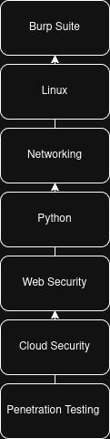

# Chapter 23

> **"Learning one tool is the beginning of your journey, not the end of it."**
>
> — **Henry Uwaezuoke**

**Your Journey Doesn't End Here**

If you've made it this far, take a moment to appreciate how much you've learned.

When you opened the first chapter of this book, Burp Suite may have looked like a complicated application filled with unfamiliar tabs and technical terms.

Today, you understand much more than the software itself.

You've learned how browsers communicate with servers.

You've learned how HTTP requests and responses work.

You've intercepted traffic, modified requests, analysed responses, and built practical experience that many beginners never take the time to develop.

More importantly, you've begun developing the mindset of a cybersecurity professional.

That's something to be proud of.

But here's something I've learned throughout my own cybersecurity journey.

No single tool will ever define your career.

Burp Suite is one of the most important tools for web application security, but it's only one piece of a much larger picture.

The skills you've developed while working through this book—patience, observation, curiosity, and consistency—will continue serving you long after you've closed Burp Suite.

Those qualities matter far more than any single tool you'll ever learn.

---

**What Comes Next?**

One of the questions readers often ask me is,

*"What should I learn after Burp Suite?"*

My answer is always the same.

Keep building your foundation.

Spend time improving your Linux skills.

Strengthen your networking knowledge.

Learn basic Python scripting.

Study the OWASP Top 10 in greater detail.

Build a home lab where you can practise regularly.

Most importantly, keep challenging yourself with real-world exercises.

Cybersecurity isn't a destination.

It's a lifelong journey of learning.

---

*Burp Suite is an excellent starting point, but it is only one step in your cybersecurity journey. Continue building your skills in Linux, networking, Python, web security, and practical lab work to become a well-rounded cybersecurity professional.*

---

**From My Lab**

One thing I've noticed throughout my career is that every new skill makes the previous one more valuable.

Learning Linux made Burp Suite easier to use.

Understanding networking helped me analyse web traffic with greater confidence.

Learning scripting allowed me to automate repetitive tasks.

Nothing I learned was wasted.

Each skill became another building block.

That's why I encourage every beginner to keep learning, even after finishing this book.

The journey only becomes more rewarding from here.

---

**Henry's Pro Tip**

Don't rush to learn every cybersecurity tool you hear about.

Master one.

Practise it.

Understand it.

Then move on to the next.

Depth will always be more valuable than collecting tools you barely know how to use.

---

**Stop and Think**

Take a notebook and answer these questions:

- Which chapter taught me the most?
- Which topic do I still want to practise?
- What skill do I want to learn next?

Your answers will help shape your personal learning roadmap.

---

**Lab Challenge**

Create a six-month learning plan.

Include:

- Linux practice
- Networking review
- Python basics
- Burp Suite labs
- OWASP Top 10 study
- Portfolio projects

Review your plan every month and update it as your skills grow.

Small, consistent progress will take you much further than occasional bursts of motivation.

---

**Before the Final Chapter**

You've completed the technical journey this book was designed to take you through.

You've built a solid foundation in Burp Suite.

But before we close this book together, I'd like to share one final message with you.

It's not about Burp Suite.

It's not about tools.

It's about you, your future, and the kind of cybersecurity professional you're becoming.

I'll meet you there.

— **Henry Uwaezuoke**

