# Mastering Burp Suite

**A Practical Beginner's Guide to Web Application Security Testing**

*Learn to Intercept, Analyze, and Test Web Applications with Confidence*

---

**Henry Uwaezuoke**

Cybersecurity Educator  
SOC Analyst  
Penetration Tester  
Technical Author

---

**Henry Uwaezuoke Cybersecurity Series**

**Learn. Practice. Secure.**

---

**First Edition**

Copyright © 2026 Henry Uwaezuoke

All rights reserved.

# Copyright

**Mastering Burp Suite: A Practical Beginner's Guide to Web Application Security Testing**

**First Edition**

Copyright © 2026 Henry Uwaezuoke

All rights reserved.

No part of this publication may be reproduced, stored in a retrieval system, transmitted, distributed, or reproduced in any form or by any means, whether electronic, mechanical, photocopying, recording, or otherwise, without the prior written permission of the copyright holder, except for brief quotations used in reviews or scholarly references.

---

 **Educational Use Notice**

This book is intended solely for educational, training, and professional development purposes.

All demonstrations, examples, screenshots, and practical exercises were performed in controlled laboratory environments or on intentionally vulnerable applications designed for cybersecurity training.

The techniques explained throughout this book should only be used on systems, applications, and networks for which you have explicit authorization to test.

Unauthorized access to computer systems is illegal, unethical, and may result in criminal or civil penalties.

The author and publisher accept no responsibility for the misuse or unlawful application of the information contained in this publication.

Readers are solely responsible for ensuring that all activities comply with the laws and regulations of their country or jurisdiction.

---

 **Trademarks**

Burp Suite® is a registered trademark of PortSwigger Ltd.

DVWA (Damn Vulnerable Web Application) is an open-source project developed for web application security education and training.

All other trademarks, product names, company names, and logos mentioned in this book are the property of their respective owners and are used solely for identification and educational purposes.

No affiliation with, endorsement by, or sponsorship from the respective trademark owners is implied.

---

Published independently by Henry Uwaezuoke

2026

# Disclaimer

This book has been written for **educational purposes only**.

The information, demonstrations, screenshots, tools, techniques, and practical exercises presented throughout this book are intended to help readers learn web application security testing in a safe, legal, and ethical manner.

Every practical example in this book was performed in a controlled laboratory environment using intentionally vulnerable applications or systems specifically designed for cybersecurity training.

Always obtain **explicit written authorization** before testing any application, website, server, network, or computer system that you do not own or manage.

Unauthorized access to computer systems is illegal in many countries and may result in criminal prosecution, civil liability, or both.

The author and publisher accept no responsibility for any misuse of the information contained in this book or for any loss, damage, or legal consequences resulting from the improper or unlawful use of the techniques described.

---

**A Word on Ethics**

One of the things I love most about cybersecurity is that it gives us the opportunity to make technology safer for everyone.

The knowledge you gain from this book should never be used to harm others.

As you work through the practical exercises, always remember these principles:

- Respect the law.
- Respect privacy.
- Respect authorization.
- Use your skills to protect, not to exploit.
- Never stop learning.

The best cybersecurity professionals are not remembered because they know the most.

They're respected because they use their knowledge responsibly.

I hope you'll become one of them.

— **Henry Uwaezuoke**

# Dedication

This book is dedicated to every beginner who has ever looked at cybersecurity and quietly wondered,

*"Can I really do this?"*

The answer is **yes**.

With patience, consistency, and a willingness to keep learning, today's beginner can become tomorrow's cybersecurity professional.

I also dedicate this book to the mentors, educators, and professionals who generously share their knowledge and continue to strengthen the cybersecurity community through teaching, guidance, and service.

Finally, to my family, friends, and everyone who has supported my journey, thank you for believing in me, encouraging me, and reminding me that every great achievement begins with a single step.

I hope this book gives you the confidence to keep learning, keep practising, and never stop improving.

May it serve as a small part of your own journey into cybersecurity.

— **Henry Uwaezuoke**

# Preface

When I first started learning cybersecurity, one lesson became clear very quickly:

**Reading about security is not enough.**

Real understanding comes from practice.

You can spend hours watching videos, reading articles, and studying documentation, but until you begin working with the tools yourself, everything remains theoretical.

That realization became the foundation of this book.

I didn't want to write another technical manual that simply explains what every button in Burp Suite does.

Instead, I wanted to create the kind of book I wish I had when I was starting out—a practical guide that explains not only **how** to use Burp Suite, but also **why** each tool matters and when to use it.

Throughout these chapters, you'll follow a logical learning path. We'll begin with the fundamentals, build your confidence one step at a time, and gradually move into real-world scenarios that reflect how Burp Suite is used in professional security testing.

Whenever possible, I've included practical examples, observations from my own lab, and lessons I've learned throughout my cybersecurity journey. My hope is that these experiences will help you avoid some of the mistakes I made and encourage you to keep moving forward whenever a concept feels challenging.

Whether your goal is to become a SOC analyst, a penetration tester, a secure software developer, or simply to understand how modern web applications are tested, I hope this book gives you the knowledge and confidence to take that next step.

Thank you for trusting me to be part of your learning journey.

Now, let's open Burp Suite and get to work.

— **Henry Uwaezuoke**

# About the Author

\begin{center}
\includegraphics[width=0.25\textwidth]{01_Manuscript/images/author-headshot.png}
\end{center}

Henry Uwaezuoke is a cybersecurity educator, SOC analyst, penetration tester, and technical author passionate about helping beginners build practical, real-world cybersecurity skills.

**Cybersecurity is best learned by doing.**

Rather than relying only on theory, Henry believes real confidence is built by working through practical labs, analysing real-world scenarios, making mistakes, and learning from them.

His work focuses on Linux, web application security, network security, ethical hacking, defensive security, and helping aspiring cybersecurity professionals build successful careers.

The **Henry Uwaezuoke Cybersecurity Series** was created to bridge the gap between theory and practice. Every book is written with one goal in mind: to make complex cybersecurity topics easier to understand through clear explanations, practical demonstrations, and hands-on exercises that readers can follow at their own pace.

When he isn't writing or researching cybersecurity topics, Henry enjoys building practical labs, developing educational resources, and sharing knowledge that helps others grow in the cybersecurity community.

His mission is simple:

**To make cybersecurity education practical, accessible, ethical, and inspiring for anyone willing to learn.**

---

 **Connect with Henry Uwaezuoke**

Continue your cybersecurity journey with practical resources, future books, and hands-on learning.

**Cybersecurity Portfolio**  
https://bihghefty.github.io/cyberportfolio/

**Amazon Author Page**  
https://www.amazon.com/author/henryuwaezuoke

**LinkedIn**  
https://www.linkedin.com/in/henry-uwaezuoke-34681b411

**GitHub**  
https://github.com/bihghefty

**Email**  
henryeuwaezuoke@gmail.com

# Acknowledgements

No meaningful journey is ever completed alone.

This book is the result of countless hours of learning, practising, researching, testing, writing, editing, and refining. Along the way, I've been encouraged, inspired, and supported by many people, and I'm sincerely grateful to every one of them.

First and foremost, I give all glory and thanks to God for the wisdom, strength, good health, and perseverance to complete this project. Without His grace, this book would never have become a reality.

To my family and friends, thank you for your patience, encouragement, and unwavering support throughout this journey. Your belief in me gave me the confidence to keep moving forward, even during the most challenging moments.

I am also deeply grateful to the global cybersecurity community. The professionals, educators, researchers, and open-source contributors who freely share their knowledge have helped shape not only this book but also my own growth in cybersecurity. Your willingness to teach others continues to make this industry stronger.

To the developers behind Burp Suite, DVWA, and the many open-source security tools used throughout this book, thank you for creating resources that allow beginners to learn through practical, hands-on experience.

Finally, thank you to every reader who chose this book.

The fact that you've invested your time in learning web application security tells me that you're serious about improving yourself, and I genuinely respect that.

I hope the knowledge you gain from these pages helps you build confidence, sharpen your skills, and take another step towards becoming the cybersecurity professional you aspire to be.

Thank you for allowing me to be part of your journey.

— **Henry Uwaezuoke**

# A Promise to the Reader

Before you turn the page and begin Chapter One, I'd like to make you a promise.

This book will not assume you already know web application security.

It will not overwhelm you with unnecessary jargon or expect you to memorise technical terms without understanding them.

Instead, we'll learn together—one concept, one tool, and one practical exercise at a time.

Everything in this book has been written with one goal in mind:

**To help you build genuine confidence through practical, hands-on learning.**

You'll find explanations before demonstrations.

You'll understand the *why* before the *how*.

You'll be encouraged to practise, think critically, and develop the mindset of a cybersecurity professional rather than simply following instructions.

Most importantly, I promise to be honest with you.

Cybersecurity isn't something you master overnight.

Like any worthwhile skill, it takes patience, consistency, curiosity, and practice.

Some chapters may challenge you.

Some concepts may require you to pause, revisit them, and try again.

That's perfectly normal.

Keep going.

Every page you read, every lab you complete, and every question you ask is another step forward.

By the time you reach the final chapter, my hope is that Burp Suite will no longer feel like an intimidating application, but a familiar tool that helps you think like a cybersecurity professional.

Thank you for placing your trust in me.

I'll do my best to make every chapter practical, clear, and worth your time.

Now, let's begin.

— **Henry Uwaezuoke**

# Chapter 1

 **Welcome to Your Burp Suite Journey**

Welcome.

I'm genuinely glad you're here.

If you've decided to learn Burp Suite, you've already taken an important step towards becoming a better cybersecurity professional.

You've moved beyond simply reading about security and chosen to start learning by doing.

That's exactly how I began my own journey.

The first time I opened Burp Suite, I honestly had no idea what I was looking at.

There were tabs everywhere.

Buttons I didn't understand.

Windows opening inside other windows.

For a moment, I wondered if I was really ready for this.

Maybe you've had that same feeling.

If you have, you're not alone.

The good news is that you don't have to understand everything today.

You don't have to master Burp Suite in one sitting.

We'll take it one step at a time.

By the end of this book, I want Burp Suite to feel like a familiar tool instead of a confusing one.

We're going to practise together.

We'll make mistakes together.

We'll learn from every exercise.

That's how real cybersecurity skills are built.

# Chapter 2

**Understanding How Web Applications Communicate**

Before we dive deeper into Burp Suite, I'd like you to understand something that completely changed the way I look at web applications.

Every time you open a website, log into your account, search for something, or click a button, your browser and the web server are having a conversation.

You don't see that conversation because it happens in the background, often in less than a second.

Burp Suite allows us to slow that conversation down so we can understand what's happening.

Once you understand how that communication works, the rest of Burp Suite becomes much easier to learn.

---

**Imagine You're Ordering Food**

Let's make this simple.

Imagine you're sitting in a restaurant.

You tell the waiter what you want to eat.

The waiter takes your order to the kitchen.

The kitchen prepares your meal.

The waiter returns with your food.

That's exactly how a web application works.

- You are the client.
- Your browser is the waiter.
- The web server is the kitchen.
- The response is the meal that comes back.

Every click you make follows that same pattern.

Understanding this simple process is one of the most important lessons in web application security.

---

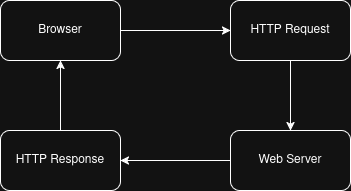{ width=80% }

*A simple illustration of how a web browser communicates with a web server. Every action you perform on a website begins with an HTTP request from the browser. The server processes that request and returns an HTTP response containing the requested page, data, or resource. This request-and-response cycle forms the foundation of everything you'll do with Burp Suite.*

---

As you study this diagram, notice the direction of the communication.

The browser sends a request.

The server processes that request.

The server sends back a response.

That conversation happens every single time you interact with a website.

Whether you're logging in, searching for information, or submitting a form, the same process takes place.

---

**Where Burp Suite Fits In**

Now imagine placing someone between the waiter and the kitchen.

Before the order reaches the kitchen, that person reads it.

They can inspect it.

They can change it.

They can even stop it from moving.

That's exactly what Burp Suite does.

Instead of allowing requests to travel directly between your browser and the web server, Burp Suite quietly places itself in the middle.

This gives you the opportunity to observe what the browser is sending and understand what the server sends back.

That's why Burp Suite is called an **intercepting proxy**.

---

**Lessons I Learned**

When I first started learning Burp Suite, I focused too much on the buttons and menus.

Everything felt complicated.

What finally helped me was understanding the conversation between the browser and the server.

Once that idea clicked, every Burp Suite tool started to make sense because I understood what the software was actually showing me.

Sometimes one simple idea changes everything that comes after it.

---

**Before We Continue**

Don't worry about remembering every technical term in this chapter.

Right now, I simply want you to remember one important idea:

**Every action you perform on a website creates an HTTP request and an HTTP response.**

Burp Suite helps you see that conversation.

Everything else in this book builds upon that foundation.

---

**A Final Thought**

The best cybersecurity professionals don't just know how to use tools.

They understand what those tools are showing them.

That's the mindset I want you to develop throughout this book.

We'll keep building that understanding together, one chapter at a time.

Take your time with these fundamentals.

The stronger your foundation becomes, the easier every practical exercise will feel.

I'll see you in the next chapter.

— **Henry Uwaezuoke**

# Chapter 3

**Installing Burp Suite**

Before we can explore Burp Suite, we need to get it running on our computer.

If you're new to cybersecurity, don't let this chapter make you nervous.

Installing Burp Suite is much easier than many people expect, and I'll guide you through the process one step at a time.

By the end of this chapter, you'll have Burp Suite installed and ready for the practical exercises that follow.

---

**Choosing the Right Edition**

One of the first questions beginners ask is:

**"Which version of Burp Suite should I install?"**

For this book, we'll use **Burp Suite Community Edition**.

It's free, widely used, and contains everything you need to complete the practical exercises in this guide.

As your skills grow, you can always explore the Professional Edition, but there is no need to spend money while you're still building your foundation.

Learning the fundamentals is far more important than owning every feature.

---

**Downloading Burp Suite**

Visit PortSwigger's official website and download the latest version of **Burp Suite Community Edition** for your operating system.

Always download security tools from their official source.

Doing so helps ensure you're using authentic software, receiving the latest updates, and avoiding modified or malicious downloads.

---

{ width=80% }

*The official PortSwigger download page for Burp Suite Community Edition. Always download Burp Suite directly from the official website to ensure you're using a genuine, up-to-date, and trusted version of the software.*

---

**Installing the Application**

Run the installer and follow the installation steps for your operating system.

The default installation settings are suitable for most users, so there's usually no need to change them.

Once the installation is complete, launch Burp Suite.

The first launch may take a little longer than usual.

That's perfectly normal.

---

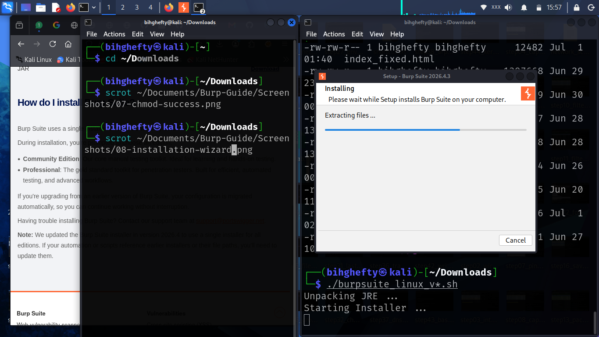{ width=80% }

*The Burp Suite installation wizard guides you through the setup process. For most users, the default installation options are recommended and require no additional configuration.*

---

**Lessons I Learned**

The first time I installed Burp Suite, I spent more time worrying about whether I had installed it correctly than actually using it.

Looking back, I realised something important.

The best way to learn a tool isn't by staring at the installation screen—it's by opening the application and beginning to explore.

Don't wait until you feel "ready."

Start learning now.

Confidence comes through practice.

---

**Before We Continue**

Before moving to the next chapter, make sure:

- Burp Suite opens successfully.
- You can see the main interface.
- There are no installation errors.

If everything looks good, you're ready for the next step.

---

**A Final Thought**

Every cybersecurity professional remembers the first security tool they learned to use with confidence.

For many people, Burp Suite becomes one of those tools.

You're taking that first step today.

Keep going.

Every expert you admire once stood exactly where you are now.

Master this tool one lesson at a time, because you'll continue using it throughout your cybersecurity journey.

I'll see you in the next chapter.

— **Henry Uwaezuoke**

# Chapter 4

**Before You Begin**

Before we start working with Burp Suite, I'd like us to spend a few minutes preparing our lab.

I know this isn't the most exciting part of the book, but it's one of the most important.

A well-prepared lab allows you to practise with confidence, make mistakes safely, and repeat exercises whenever you need to.

That's exactly how real skills are built.

Think of this chapter as laying the foundation for everything that follows.

---

**Learning in a Safe Environment**

Throughout this book, we'll use **Damn Vulnerable Web Application (DVWA)** as our practice target.

DVWA was created specifically for learning web application security.

It contains intentionally vulnerable features that allow you to practise safely without attacking real systems.

That's an important distinction.

Everything you do in this book should be performed only in environments that you own or have explicit permission to test.

Ethical hacking begins with permission.

Professional cybersecurity is built on responsibility.

---

{ width=80% }

*The DVWA login page confirms that your practice environment is running correctly. Before continuing, verify that DVWA is accessible in your browser and that you can sign in using the default credentials. Throughout this book, DVWA will serve as the safe practice environment for all hands-on exercises.*

---

**Organising Your Workspace**

Before opening Burp Suite, make sure you have:

- Burp Suite Community Edition installed.
- DVWA running correctly.
- Firefox available for testing.
- A notebook or digital document for taking notes.

You'll be surprised how often a small observation during a lab becomes useful later.

I still keep notes from my own practice sessions because every experiment teaches me something new.

---

**Lessons I Learned**

When I first started building cybersecurity labs, I was always eager to jump straight into testing.

More than once, I forgot to check whether my lab was properly configured.

Sometimes DVWA wasn't running.

Other times, Burp Suite wasn't listening on the correct port.

Those small oversights taught me an important lesson.

Spending a few minutes preparing your environment can save you a lot of time later.

Preparation is part of the learning process.

---

**Before We Move Forward**

Take a few minutes to confirm that everything is working.

Open DVWA.

Launch Burp Suite.

Open Firefox.

If all three are ready, you're in a great position to begin the practical chapters that follow.

There's no need to rush.

We'll build your confidence one exercise at a time.

---

**One Last Thought**

One of the habits that has helped me most in cybersecurity is taking my time.

Not because I'm slow, but because understanding is more valuable than speed.

As you work through this book, don't measure your progress by how many chapters you finish.

Measure it by how much you understand.

If a chapter takes an extra day because you repeated the lab several times, that's not falling behind.

That's learning.

Take your time.

A well-prepared lab makes every lesson that follows much easier.

I'll meet you in the next chapter.

— **Henry Uwaezuoke**

# Chapter 5

**Exploring the Burp Suite Dashboard**

Congratulations.

You've installed Burp Suite, prepared your lab, and you're finally ready to explore the application itself.

The first time I opened Burp Suite, I spent a few moments simply looking at the interface before clicking anything.

There were tabs across the top, panels everywhere, and I honestly wasn't sure where to begin.

If you're feeling the same way right now, don't worry.

You don't have to understand every button today.

By the end of this chapter, you'll know what each major section is for and, more importantly, you'll know where to go when you need it.

Let's take a tour of the interface together.

---

**Your First Look**

When Burp Suite opens, the interface can appear busy.

That's perfectly normal.

Remember, Burp Suite isn't just one tool.

It's a collection of tools designed to work together.

Each tab has a different purpose, and throughout this book we'll explore them one by one.

For now, I simply want you to become comfortable looking around.

Don't click everything.

Observe first.

One lesson I've learned over the years is that curiosity is one of the most valuable skills in cybersecurity.

The more you observe, the more you'll understand.

---

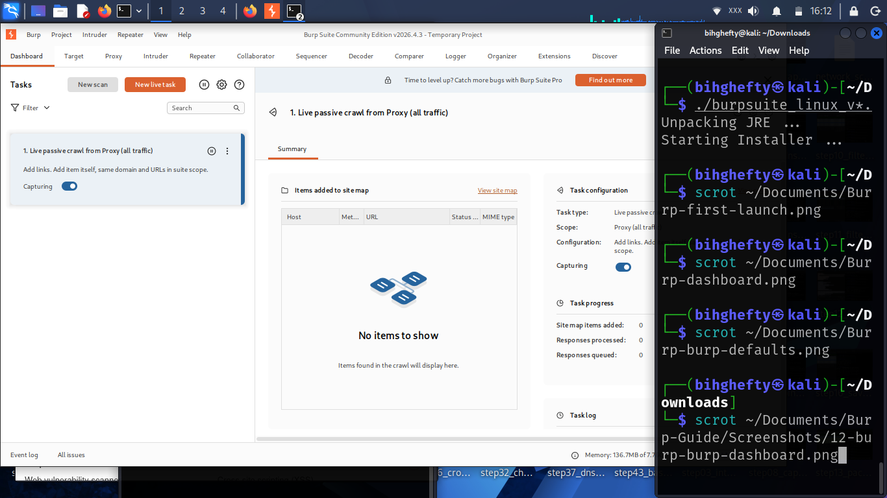{ width=80% }

*Figure 5.1: The Burp Suite Dashboard serves as the central workspace of the application. From here, you can monitor project activity, review issues, and access the various tools you'll use throughout this book.*

---

**The Main Tabs**

Let's briefly introduce the tools you'll be using throughout this book.

**Dashboard**

The Dashboard gives you an overview of what Burp Suite is doing.

Think of it as your control centre.

It's where you'll monitor activity and quickly see what's happening inside your project.

---

**Proxy**

The Proxy tool allows Burp Suite to sit between your browser and the web server.

This is where you'll intercept, inspect, and forward HTTP requests.

We'll spend a lot of time here because it's the foundation of almost everything you'll do with Burp Suite.

---

**Repeater**

Repeater lets you send the same request again and again while making small changes each time.

It's one of the best tools for understanding how applications respond to different inputs.

---

**Intruder**

Intruder automates repetitive testing.

Instead of manually changing one value after another, Burp Suite can test many values for you.

Later in this book, we'll practise using Intruder safely inside DVWA.

---

**Logger**

Logger records the traffic passing through Burp Suite.

It's useful when you want to review previous activity or troubleshoot something that happened earlier during testing.

---

**Lessons I Learned**

When I first discovered Burp Suite, I believed I needed to master every tool before I could begin testing.

That wasn't true.

What really helped me was focusing on one feature at a time.

Once I became comfortable with the Proxy tool, learning Repeater became much easier.

Then Intruder started to make sense.

Don't put pressure on yourself to learn everything today.

Small, consistent progress will always take you further than trying to learn everything at once.

---

**Stop and Think**

Take another look at the Burp Suite window.

Without clicking anything, ask yourself this question:

**If someone asked me where I would inspect a request, which tab would I choose?**

If your answer is **Proxy**, you're already beginning to understand how Burp Suite is organised.

---

**Before We Continue**

You don't need to memorise every tab in this chapter.

The goal is simply to become familiar with the interface.

Over the next few chapters, we'll open each tool together and learn what it does through practical exercises.

By the end of this book, these tabs will feel as familiar as the menus in your web browser.

---

**Looking Ahead**

Now that you've seen the Burp Suite interface, it's time to start using it.

In the next chapter, we'll open one of the most important tools in Burp Suite—the **Proxy**.

That's where you'll begin seeing the conversations between your browser and the web server for the first time.

Take your time.

Enjoy the process.

You're building a solid foundation that everything else in this book will build upon.

— **Henry Uwaezuoke**

# Chapter 6

**Meeting the Proxy Tool**

This is the chapter where Burp Suite truly starts to come alive.

Up to this point, we've prepared our lab, explored the interface, and learned how web applications communicate. Now it's time to begin using the tool that makes Burp Suite so powerful.

The Proxy tool is the heart of Burp Suite.

Every request your browser sends and every response the server returns can pass through the Proxy tool.

Once you understand how the Proxy works, you'll understand how Burp Suite works.

Let's take our first real look inside the Proxy tool together.

---

**What Is the Proxy Tool?**

Imagine sending a letter to a friend.

Normally, the letter goes directly from you to your friend.

Now imagine giving that letter to someone you trust before it is delivered.

That person can read it, check it, or even hand it back to you before sending it on.

That's exactly what the Proxy tool does.

Instead of allowing your browser to communicate directly with the web server, Burp Suite quietly places itself between the two.

Every request passes through Burp Suite before reaching the server, and every response passes back through Burp Suite before reaching your browser.

That gives you the opportunity to observe, analyse, and eventually modify the traffic.

For anyone learning web application security, this is one of the most powerful features Burp Suite offers.

---

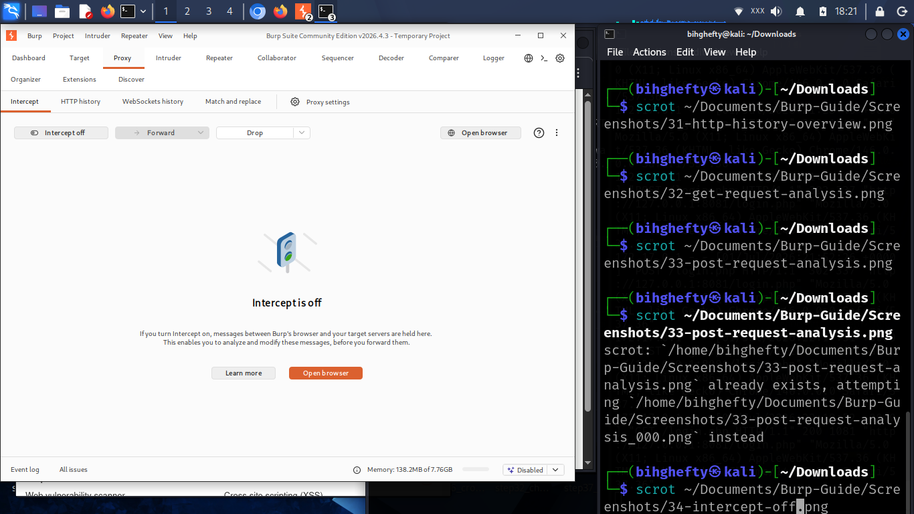{ width=80% }

*Figure 6.1: The Burp Suite Proxy tool with Intercept turned off. In this state, requests pass normally through Burp Suite while allowing you to observe browser traffic before learning how to pause and inspect individual requests.*

---

**Why the Proxy Matters**

Every time you:

- Open a webpage
- Submit a login form
- Search for information
- Upload a file

your browser sends a request to the server.

The server processes that request and sends a response back.

The Proxy allows you to watch that conversation happen.

Later, you'll learn how to pause those requests before they reach the server, inspect them, and even modify them.

Understanding this process is one of the biggest steps towards thinking like a web application security tester.

---

**Lessons I Learned**

When I first opened the Proxy tab, I expected something dramatic to happen.

Nothing did.

It took me a while to realise that the Proxy only becomes useful when your browser is actually sending traffic through Burp Suite.

That taught me an important lesson.

Security tools don't create activity on their own—they help you observe activity that's already happening.

Once I understood that, everything started to make sense.

---

**Stop and Think**

Before moving on, ask yourself this question:

**If Burp Suite wasn't acting as a proxy, would it be able to see your browser's requests?**

The answer is **no**.

That's why configuring your browser to send traffic through Burp Suite is such an important step.

---

**Common Beginner Mistakes**

When people first begin using Burp Suite, they often:

- Forget to configure Firefox to use Burp Suite.
- Expect requests to appear without browsing to a webpage.
- Think the Proxy is broken because no traffic appears.
- Become overwhelmed by the amount of information displayed.

If any of those happen to you, don't worry.

They're all part of the learning process.

---

**Before We Continue**

Open Burp Suite.

Click the **Proxy** tab.

Spend a few minutes looking around.

Notice where the **Intercept** button is.

Notice the **HTTP History** tab.

Notice the **Forward** and **Drop** buttons.

You don't need to understand them yet.

For now, simply become comfortable with the layout.

In the next chapter, we'll begin using these features for the first time.

---

**Looking Ahead**

The Proxy lets you observe web traffic.

The next chapter introduces the feature that gives you control over it.

We'll turn on **Intercept**, pause requests before they reach the server, and begin interacting with web applications in a completely different way.

Take your time.

The stronger your understanding of the Proxy, the easier the rest of Burp Suite will become.

Every chapter builds on the one before it, and you're making steady progress.

I'll be right here with you.

— **Henry Uwaezuoke**

# Chapter 7

**Taking Control of HTTP Requests with Intercept**

There comes a point when every Burp Suite beginner asks the same question:

*"Why has my browser stopped loading?"*

If that happened to you, don't worry—you've just discovered one of Burp Suite's most important features.

The first time I enabled **Intercept** while working in DVWA, I refreshed the page and waited.

Nothing happened.

For a moment, I thought I had broken the application.

I hadn't.

Burp Suite was simply waiting for me to decide what should happen to the request.

That experience completely changed how I understood web application testing.

Instead of watching requests pass by, I was able to stop them, inspect them, and decide when they should continue.

That's exactly what you'll learn in this chapter.

By the time you finish, you'll understand why Intercept is such an important part of Burp Suite, and you'll be comfortable using it with confidence.

---

**What You'll Learn**

In this chapter, you'll learn how to:

- Turn Intercept on and off.
- Understand why requests pause.
- Forward requests to the server.
- Drop requests when necessary.
- Build confidence using one of Burp Suite's core features.

---

**Why Intercept Matters**

When you first open Burp Suite, it's easy to think the Proxy tool is doing all the work.

In reality, Intercept is what gives you control over the conversation between your browser and the web server.

Normally, when you click a link or submit a form, your browser sends the request straight to the server.

Everything happens so quickly that you never see what's being exchanged.

With Intercept turned on, Burp Suite pauses that request before it reaches the server.

That pause gives you a chance to inspect what the browser is sending, understand how the request is structured, and decide exactly what happens next.

The first few times you use it, the browser may appear to freeze.

That's completely normal.

Burp Suite is simply waiting for your decision.

Once you understand that, Intercept becomes much less intimidating—and much more useful.

---

**Let's See It in Action**

Open Burp Suite and make sure the **Proxy** tab is selected.

Click **Intercept** and confirm that it says **Intercept is on**.

Now return to Firefox and refresh your DVWA page.

At this point, the browser should stop loading.

Don't close the browser or refresh the page repeatedly.

Instead, switch back to Burp Suite.

You should now see the intercepted request waiting inside the request editor.

Take a moment to look at it.

Don't worry if some of the information doesn't make sense yet—we'll explain each part as we move through the book.

When you're ready, click **Forward**.

Go back to Firefox.

The page should load immediately.

Congratulations!

You've just intercepted and released your first HTTP request.

---

**Stop and Think**

Before reading any further, ask yourself one question:

**What would have happened if you had never clicked _Forward_?**

Your browser would still be waiting because Burp Suite was holding the request.

Once that idea clicks, the Intercept feature starts to make much more sense.

---

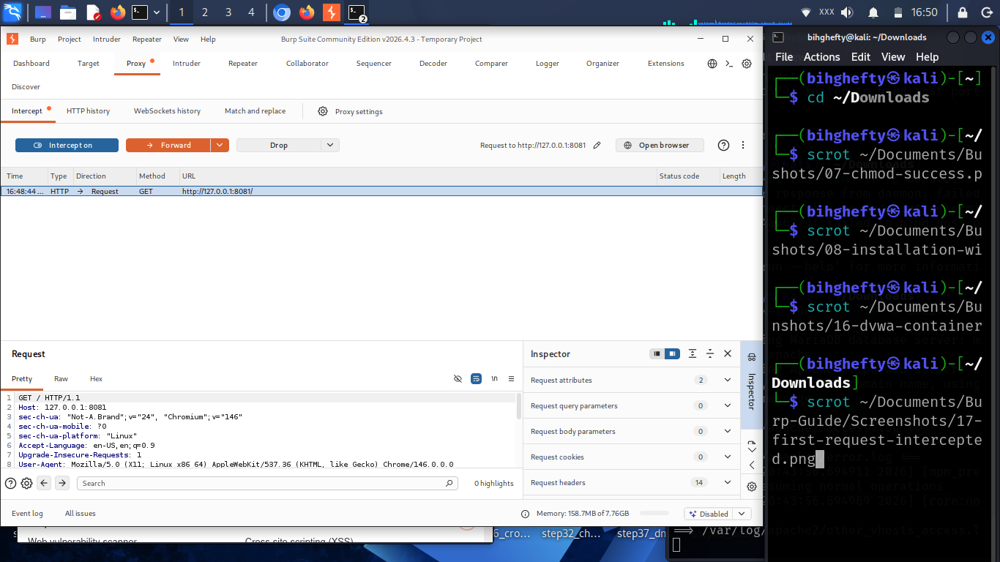{ width=80% }

*Figure 7.1: Burp Suite has intercepted an HTTP request before it reaches the target web application. The request is paused until you decide whether to forward it to the server, modify it, or drop it entirely.*

---

As you look at the screenshot, notice these areas:

- The request line at the top.
- The HTTP headers below it.
- The **Forward** button that allows the request to continue.
- The **Intercept is on** indicator.

Don't try to memorise everything on this screen.

For now, focus on understanding what Burp Suite is doing rather than every detail of the request.

---

**Lessons I Learned**

While writing this book, I ran into a problem that almost every beginner experiences.

I selected a file in DVWA and clicked **Upload**, but nothing happened.

My first thought was that I had made a mistake or that DVWA had stopped responding.

After a few moments, I looked back at Burp Suite and immediately saw the reason.

The upload request was sitting in the Intercept window, waiting for me to click **Forward**.

As soon as I forwarded the request, the upload completed successfully.

It was a simple mistake, but it taught me an important lesson that I still remember today.

Whenever a page appears to stop loading during testing, don't assume something is broken.

Always check whether Burp Suite is holding the request.

That one habit will save you a lot of frustration as you continue learning.

---

**A Few Mistakes You'll Probably Make**

Don't worry if you make these mistakes—I made some of them too while preparing this guide.

- Leaving **Intercept** turned on after finishing a test.
- Refreshing the browser several times because the page appeared to be stuck.
- Clicking **Forward** repeatedly without taking time to read the request.
- Closing Burp Suite while requests were still waiting.

These are normal beginner mistakes.

The more you practise, the more natural the workflow becomes.

---

**Troubleshooting**

**The Browser Has Stopped Loading**

This is usually the first issue beginners encounter.

Before changing any settings, check whether **Intercept** is still turned on.

If it is, look inside the request window.

If you see a request waiting, simply click **Forward**.

In most cases, the page will load immediately.

If no request appears, confirm that Firefox is still configured to send traffic through Burp Suite.

More often than not, the solution is much simpler than it first appears.

---

**Why This Matters Beyond Burp Suite**

It's easy to think that Intercept is only useful when you're learning Burp Suite, but that's not the case.

Every time you inspect a request, you're learning how web applications communicate.

You're seeing information that browsers normally hide from users.

That understanding becomes valuable long after you've finished this book.

Whether you decide to become a penetration tester, a SOC analyst, an application security engineer, or a bug bounty hunter, you'll keep coming back to the same skill: understanding how applications communicate.

That's why I encourage you not to rush through this chapter.

Spend a little extra time here.

The confidence you build now will make the rest of Burp Suite much easier to understand.

---

**Before You Move On**

Before continuing, open DVWA one more time and practise with Intercept.

Turn it on.

Refresh a page.

Watch the request appear.

Click **Forward**.

Repeat the process until it feels comfortable.

Don't worry about memorising every header or every line in the request.

Right now, the goal is simply to understand the flow.

When you can confidently explain why the browser pauses and what happens after clicking **Forward**, you're ready for the next chapter.

---

**Quick Challenge**

Without looking back through this chapter, answer these questions:

- Why did the browser stop loading?
- What changed after you clicked **Forward**?
- What would happen if you clicked **Drop** instead?
- Why is Intercept one of the most important features in Burp Suite?

If you can answer those questions in your own words, you've understood the main idea behind Intercept.

---

**Wrapping Up**

When I first started learning Burp Suite, I thought Intercept was there to slow me down.

Now I see it differently.

Intercept gives you something browsers normally don't: the opportunity to slow down, observe each request, and understand exactly what's happening between the client and the server.

That simple pause is one of the reasons Burp Suite has become one of the most trusted tools in web application security.

Take your time with this chapter.

The better you understand Intercept, the easier the rest of Burp Suite will become.

---

**Coming Up Next**

So far you've seen how to stop a request before it reaches the server.

In the next chapter, we'll explore **HTTP History** and learn how Burp Suite keeps a record of every request and response that passes through the Proxy.

By the end of that chapter, you'll know how to revisit previous requests, compare responses, and retrace your testing activity with confidence.

---

**A Final Thought**

One of the biggest lessons I've learned is that good security testing isn't about clicking as many buttons as possible.

It's about slowing down long enough to understand what's happening.

Burp Suite gives you that opportunity.

Every request tells a story.

Every response reveals something new about how an application behaves.

The more curious you are, the more you'll learn.

As you continue through this book, don't rush from one chapter to the next.

Open your lab, repeat the exercises, and ask yourself why each step works the way it does.

That's how real understanding is built.

— **Henry Uwaezuoke**

# Chapter 8

**Looking Back with HTTP History**

Have you ever visited a website, clicked through several pages, and then wished you could go back and see exactly what happened?

That's exactly what HTTP History helps you do.

When I first started using Burp Suite, I thought I had to intercept every request to learn something useful.

I was wrong.

Sometimes the best way to understand an application is to let it work normally, then review everything afterwards.

That's where HTTP History becomes one of your most valuable tools.

Instead of stopping every request, it quietly records them for you.

Let's see how it works.

---

**What Is HTTP History?**

Every time your browser communicates with a website through Burp Suite, that conversation can be recorded.

HTTP History is simply a chronological list of those conversations.

Think of it as your browser's diary.

Every request.

Every response.

Every page you visited.

Everything remains there until you decide to clear it.

This makes HTTP History incredibly useful when you're trying to understand how an application behaves.

---

{ width=80% }

*The HTTP History tab records every HTTP request and response that passes through Burp Suite. Each entry represents a single interaction between your browser and the target application, making it easy to review your browsing activity and understand how the application communicates.*

---

Take a minute to look at the list of requests.

Notice that each row represents one interaction between your browser and the server.

At first, it may look like a lot of information.

Don't worry.

We'll learn how to read it together.

---

**Let's Generate Some Traffic**

Open Firefox.

Browse through DVWA.

Click several different pages.

Log in if necessary.

Open the **Instructions** page.

Return to Burp Suite.

Now click **Proxy → HTTP History**.

You should see multiple requests waiting for you.

Congratulations.

You've just captured your first browsing session.

---

{ width=80% }

*Selecting an entry from HTTP History displays the complete HTTP request and response. This captured GET request shows how Burp Suite allows you to inspect the communication between your browser and the web server after the request has already been processed.*

---

Notice how every page you visited appears in the history.

This is one of the reasons HTTP History is so valuable.

Even if you didn't intercept a request, Burp Suite still remembers it.

---

**Lessons I Learned**

When I first discovered HTTP History, I ignored it.

I thought Intercept was the only feature that mattered.

Later, while testing an application, I couldn't remember which page had submitted a request.

Instead of repeating the entire process, I opened HTTP History.

Everything I needed was already there.

That day taught me something simple.

Good security testing isn't only about capturing requests.

It's also about knowing how to find them again.

---

**Stop and Think**

Imagine you're testing a website with twenty different pages.

Would it be easier to repeat every action...

or simply open HTTP History and review what Burp Suite has already recorded?

That's one of the reasons experienced testers rely on HTTP History so often.

---

**Common Beginner Mistakes**

Some beginners think HTTP History only records intercepted requests.

It doesn't.

Others clear the history too early and lose useful information.

My advice is simple.

Keep the history until you've finished your testing session.

You never know which request you'll need later.

---

**Before We Continue**

Spend five minutes browsing DVWA.

Don't try to test anything yet.

Just explore.

Then come back to HTTP History and see how much information Burp Suite has collected.

The more traffic you generate, the more comfortable you'll become reading requests and responses.

---

**A Final Thought**

One lesson I've learned over the years is that good testers don't rely on memory.

They rely on evidence.

HTTP History gives you that evidence.

It records your journey through an application and allows you to retrace your steps whenever you need to.

Get into the habit of checking it often.

In the future, you'll be glad you did.

The more comfortable you become reading HTTP History, the easier it will be to understand how web applications really work.

I'll see you in the next chapter.

— **Henry Uwaezuoke**

# Chapter 9

**Working Smarter with Repeater**

One of the habits that helped me improve my web application testing was learning not to repeat the same actions in my browser over and over again.

At first, every time I wanted to test something different, I refreshed the page, filled in a form again, submitted another request, and waited for the response.

It worked.

But it wasn't efficient.

After repeating the same process several times, I found myself thinking,

*"There has to be a better way to do this."*

That's exactly why Burp Suite includes the **Repeater** tool.

The moment I understood how Repeater worked, my workflow completely changed.

Instead of capturing the same request again and again, I could capture it once, send it to Repeater, and experiment with it as many times as I wanted.

If the Proxy helps you capture requests, Repeater helps you understand them.

---

**What Is Repeater?**

Repeater is one of Burp Suite's most valuable tools.

It allows you to resend the same HTTP request repeatedly while making small changes between each attempt.

Nothing happens automatically.

You remain in complete control.

You decide what to change.

You decide when to send the request.

After every request, Burp Suite immediately displays the server's response, allowing you to observe how your changes affect the application.

This makes Repeater one of the best learning tools available for beginners.

Instead of guessing how a web application behaves, you can see it for yourself.

---

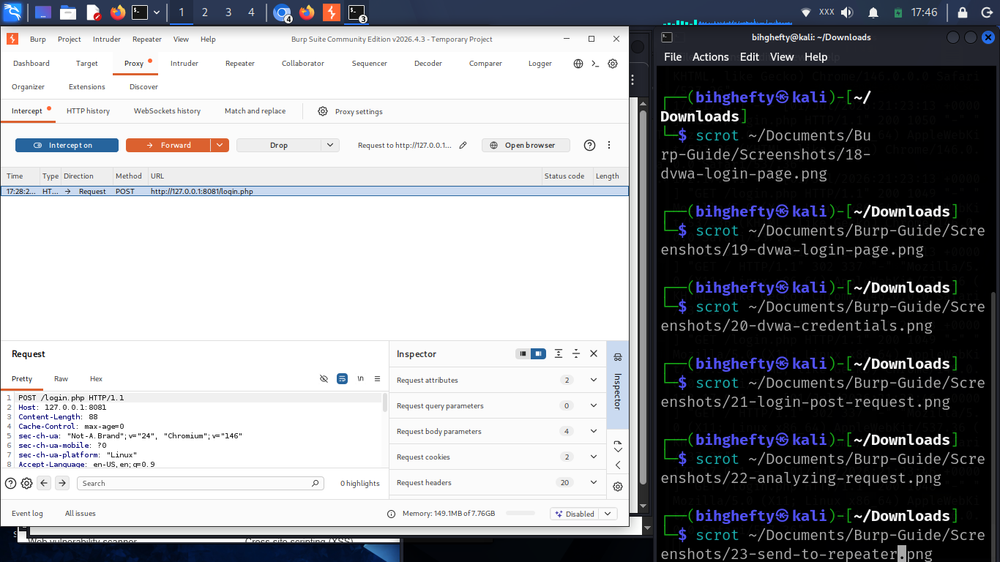{ width=80% }

*A captured HTTP request being sent from **Proxy** to **Repeater**. Repeater creates a separate working copy of the request, allowing you to modify and resend it without capturing the same request again from the browser.*

---

Once you've captured a request in **Proxy** or **HTTP History**, right-click it and select **Send to Repeater**.

The request immediately appears inside the Repeater tab.

You no longer need to repeat the action in your browser.

Everything you need is now waiting inside Burp Suite.

---

**Exploring Your First Request**

When you first open Repeater, you'll notice that the request looks exactly the same as the one Burp Suite captured.

That's intentional.

Repeater doesn't modify anything automatically.

It gives you a safe workspace where you can experiment without affecting the original request.

Spend a minute looking through the request.

Notice the HTTP method.

Look at the URL.

Read through the headers.

If there's a request body, don't worry if every line doesn't make sense yet.

The goal isn't to memorise everything.

The goal is simply to become familiar with what an HTTP request looks like.

As you continue working through this book, these requests will gradually become easier to understand.

---

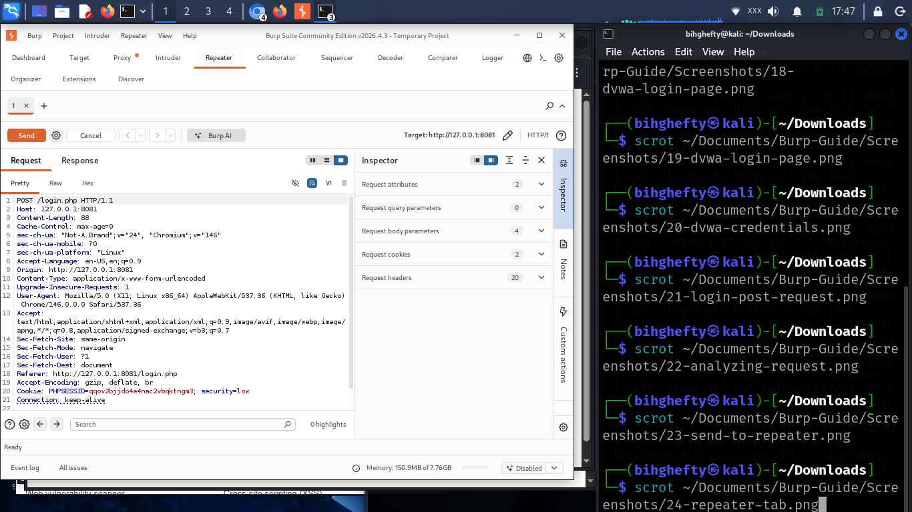{ width=80% }

*The **Repeater** *interface displaying the HTTP request on the left and the server's response on the right. This workspace allows you to edit a request, resend it, and immediately analyse how the application responds to each change.*

---

One feature I immediately appreciated was seeing the request and response side by side.

Instead of switching between different windows, everything I needed was in one place.

That simple layout makes learning much easier.

---

**Why Repeater Matters**

Imagine you're testing a login request.

You want to see what happens when one value changes.

Without Repeater, you would have to:

- Return to your browser.
- Refresh the page.
- Complete the form again.
- Submit another request.
- Capture it again.

With Repeater, you simply edit the request and click **Send**.

The response appears instantly.

That's why Repeater is one of the most frequently used tools in Burp Suite.

It encourages careful observation and helps you understand how small changes affect an application's behaviour.

---

**Lessons I Learned**

One mistake I made when I first started using Repeater was changing too many things at once.

I'd modify the username.

Change the password.

Edit a header.

Then I'd send the request.

When the response changed, I had no idea which modification had caused it.

Eventually I learned a much better approach.

Change one thing.

Click **Send**.

Study the response.

Then make another small change.

That simple habit taught me far more than making lots of changes all at once.

Even today, it's still one of the ways I approach testing.

---

**Stop and Think**

Imagine trying to solve a puzzle.

Would you change every piece at the same time?

Probably not.

You'd move one piece, observe the result, then continue.

Repeater works exactly the same way.

Small changes often teach you more than large ones.

---

**Common Beginner Mistakes**

As you begin using Repeater, it's completely normal to make a few mistakes.

Some of the most common include:

- Editing several values at once.
- Forgetting to click **Send** after modifying the request.
- Reading only the request while ignoring the response.
- Rushing through testing instead of carefully observing what changed.

Remember, Repeater isn't designed for speed.

It's designed for understanding.

---

**Before We Continue**

Open DVWA.

Capture a request.

Send it to Repeater.

Change a single value.

Click **Send**.

Study the response.

Repeat the process several times until you're comfortable moving between the request and the response.

The more you practise, the more natural this workflow will become.

---

**Looking Ahead**

You've now learned how to capture requests, review them in HTTP History, and manually replay them using Repeater.

In the next chapter, we'll explore **Intruder**, a tool that automates repetitive testing while still allowing you to stay in control of the process.

Take your time with Repeater.

It's one of the tools you'll continue using throughout your cybersecurity journey.

— **Henry Uwaezuoke**

# Chapter 10

**Let Burp Suite Do the Repetitive Work**

When I first started testing web applications, I quickly realised that some tasks became repetitive.

I'd change one value.

Send the request.

Wait for the response.

Then repeat the same process again.

After doing that several times, I found myself thinking,

*"There has to be a better way."*

That's exactly why Burp Suite includes **Intruder**.

Intruder helps automate repetitive testing so you can spend more time understanding the results instead of repeating the same steps.

Used correctly, it's a huge time saver.

---

**What Is Intruder?**

Intruder is a tool that sends multiple versions of the same request while changing specific values that you choose.

Instead of editing and sending each request manually, Burp Suite performs the repetitive work for you.

That doesn't replace your thinking.

It simply gives you more time to focus on analysing the application's behaviour.

---

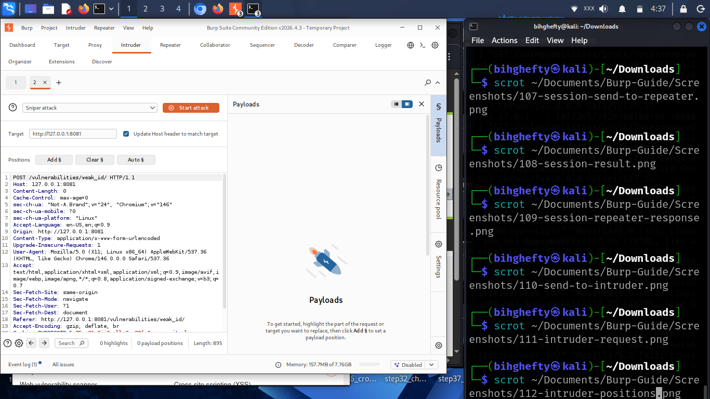{ width=80% }

*The Burp Suite **Intruder** *interface after a captured request has been sent from Proxy. The request is loaded into the **Positions** *tab and is ready for you to choose which parts of the request will be tested during an Intruder attack.*

---

Start by capturing a request.

Right-click it.

Select **Send to Intruder**.

Burp Suite copies the request into the Intruder tab, ready for testing.

---

**Understanding Positions**

One of the first things you'll notice is that Intruder highlights parts of the request.

These highlighted areas are called **positions**.

A position tells Burp Suite,

*"This is the part of the request I want to change."*

For example, you might choose to test different usernames, search terms, or other values in your own practice lab.

Learning how positions work is more important than memorising buttons.

---

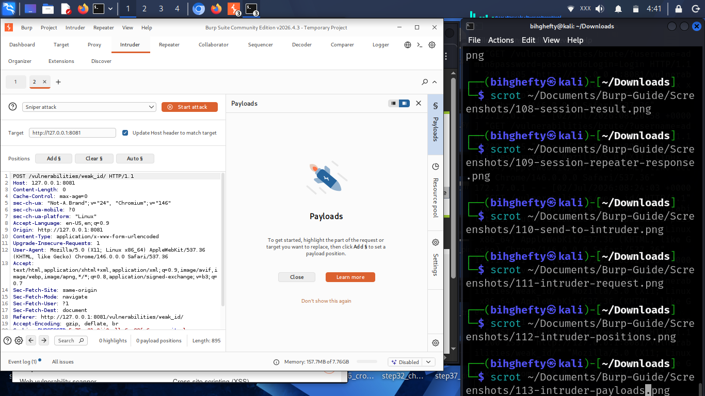{ width=80% }

*The **Payloads** *section of Burp Suite Intruder before any payloads have been added. After selecting attack positions, this is where you configure the values that Burp Suite will use during automated testing.*

---

Take your time exploring the highlighted positions.

You don't need to modify everything.

One well-chosen position is often enough to understand how the application behaves.

---

**Lessons I Learned**

When I first used Intruder, I selected far too many positions.

The results were confusing because I had changed several things at once.

Eventually, I learned to keep my testing simple.

Choose one position.

Understand the results.

Then move on to the next.

That approach made my testing much more organised.

---

**Stop and Think**

Imagine repeating the same request one hundred times by hand.

Now imagine Burp Suite doing it for you.

That's the real value of Intruder.

It reduces repetitive work so you can focus on learning from the results.

---

**Common Beginner Mistakes**

As you begin using Intruder, avoid these common mistakes:

- Selecting too many positions at once.
- Starting automated testing without understanding the original request.
- Ignoring the responses and focusing only on the number of requests sent.
- Rushing instead of analysing the application's behaviour.

Remember, automation doesn't replace understanding.

It supports it.

---

**Before We Continue**

Open DVWA.

Capture a request.

Send it to Intruder.

Explore the **Positions** tab.

Then switch to the **Payloads** tab and look at how Burp Suite allows you to define the values that will be inserted into the selected positions.

Don't worry about launching large automated attacks yet.

Today's goal is simply to understand how Intruder is organised and how its workflow fits into your testing process.

---

**Looking Ahead**

You've now learned how Burp Suite can automate repetitive tasks.

In the next chapter, we'll explore **Decoder**, a tool that helps you transform and understand encoded data.

As always, take your time.

The strongest cybersecurity skills are built through careful practice, not rushing.

I'll see you in the next chapter.

— **Henry Uwaezuoke**

# Chapter 11

**Making Sense of Encoded Data with Decoder**

As I spent more time analysing HTTP requests, I began noticing something interesting.

Not everything I saw was easy to read.

Sometimes a value looked like random letters, numbers, or strange symbols.

At first, I assumed something was wrong.

Later, I discovered that the information wasn't broken.

It was simply **encoded**.

That's when I started using Burp Suite's Decoder.

Decoder is one of those tools that quietly solves problems you'll encounter again and again during web application testing.

Once you learn how it works, you'll wonder how you managed without it.

---

**What Is Decoder?**

Decoder is a Burp Suite tool that converts data from one format into another.

During web application testing, you'll often come across information that's been encoded before being sent between the browser and the server.

Instead of trying to interpret that data manually, Decoder helps you transform it into something you can understand.

It can also perform the reverse operation by encoding information before it's sent back to the application.

The goal isn't to memorise every encoding method.

The goal is to understand what the application is sending and receiving.

---

{ width=80% }

*The Burp Suite **Decoder** *tool with text entered into the input panel. Decoder allows you to paste encoded or plain text and apply different encoding or decoding operations to better understand how web applications process data.*

Spend a minute looking around the Decoder interface.

Compared to many of Burp Suite's other tools, it looks surprisingly simple.

Don't let that simplicity fool you.

You'll find yourself returning to Decoder whenever you encounter unfamiliar values during your testing.

---

**Your First Decode**

Copy a piece of encoded text.

Paste it into Decoder.

Choose the appropriate decoding option.

Watch the output change.

The first time you see seemingly meaningless characters transformed into readable information, it feels a little like solving a puzzle.

That's one of the reasons I enjoy using Decoder.

It takes information that looks confusing and turns it into something you can understand.

---

{ width=80% }

*Burp Suite Decoder displaying the result after applying a decoding operation. The output panel shows the converted value, making it easier to analyse information that would otherwise be difficult to interpret.*

Notice how quickly the output becomes easier to understand.

That's exactly what Decoder is designed to do.

---

**Lessons I Learned**

When I first started learning web application security, I spent far too much time staring at encoded values, hoping they would somehow make sense.

Eventually, I realised I didn't have to guess.

Good security professionals don't waste time trying to decode information manually when the right tool can do it accurately in seconds.

Decoder quickly became one of the tools I reached for whenever something looked unfamiliar.

One lesson has stayed with me ever since:

**If you don't understand the data, don't ignore it.**

**Decode it.**

---

**Stop and Think**

Imagine receiving a message written in a language you don't understand.

Would you throw it away?

Or would you translate it first?

That's exactly what Decoder helps you do.

It translates information into a format that's easier to understand, allowing you to focus on analysing the application's behaviour instead of struggling with the data itself.

---

**Common Beginner Mistakes**

Many beginners assume that encoded data is encrypted.

It usually isn't.

Encoding and encryption serve very different purposes.

Another common mistake is trying every decoding option without first thinking about what kind of data they're looking at.

Take a moment to observe before experimenting.

Understanding should always come before automation.

---

**Before We Continue**

Open Decoder.

Paste a few sample values into it.

Experiment with different encoding and decoding options.

Don't worry about memorising every format today.

Your objective is simply to become comfortable using the tool and recognise when it can help you during a web application assessment.

---

**Looking Ahead**

So far, you've learned how to capture requests, replay them, automate repetitive tasks, and decode data.

In the next chapter, we'll explore another valuable Burp Suite feature called **Comparer**.

Comparer makes it much easier to identify differences between requests and responses—differences that are often too small to spot manually but can reveal important information about how an application behaves.

Take your time with this chapter.

The more comfortable you become with Decoder, the more confident you'll feel when analysing web traffic throughout the rest of this book.

I'll see you in the next chapter.

— **Henry Uwaezuoke**

# Chapter 12

**Spotting Small Differences with Comparer**

One lesson cybersecurity has taught me is that the smallest difference can sometimes explain the biggest problem.

Two requests may look almost identical.

Two responses may appear the same at first glance.

But hidden somewhere inside could be a small change that completely changes how an application behaves.

Trying to find those differences by reading line after line can quickly become frustrating.

That's where Burp Suite's **Comparer** becomes incredibly useful.

Instead of searching manually, Comparer highlights the differences for you.

---

**What Is Comparer?**

Comparer is a Burp Suite tool designed to compare two pieces of information.

Those could be:

- Two HTTP requests.
- Two HTTP responses.
- Two cookies.
- Two encoded values.
- Or any other text you want to compare.

Rather than forcing you to read everything line by line, Burp Suite immediately highlights where the differences appear.

That makes your job much easier.

---

{ width=80% }

*Two HTTP requests have been loaded into Burp Suite's Comparer tool. By selecting similar requests or responses, you can quickly identify subtle differences that may affect how a web application behaves.*

---

Choose two similar requests from HTTP History.

Right-click each one and send them to Comparer.

We'll compare them together.

---

**Reading the Results**

Once both items are loaded, Burp Suite displays them side by side.

Immediately, your eyes are drawn to the highlighted differences.

Those highlights save time.

Instead of asking,

*"What changed?"*

you can immediately begin asking,

*"Why did it change?"*

That's the question that helps you understand how an application works.

---

{ width=80% }

*The Burp Suite Comparer results window after comparing two identical items. Because both requests are the same, Comparer reports **0 Differences**. This confirms that the tool has successfully compared the selected items and found no changes between them.*

---

In this example, we intentionally compared two identical requests. Burp Suite reports 0 Differences, confirming that both items are exactly the same. If the requests contained different values—such as parameters, cookies, headers, or responses—Comparer would highlight those changes automatically, making them much easier to identify.

---

**Lessons I Learned**

I used to compare requests by opening two windows and reading them one line at a time.

It wasn't impossible.

It was simply inefficient.

The first time I used Comparer, I realised Burp Suite could do that work much faster than I could.

That experience reminded me of something I still believe today.

A good cybersecurity professional doesn't avoid hard work.

They learn to use good tools wisely.

---

**Stop and Think**

Imagine receiving two login requests.

One succeeds.

The other fails.

Wouldn't it be helpful if Burp Suite immediately showed you the exact differences?

That's exactly why Comparer exists.

---

**Common Beginner Mistakes**

Many beginners overlook Comparer because it looks simple.

Don't make that mistake.

Simple tools often solve frustrating problems.

Another common mistake is comparing completely unrelated requests.

Start by comparing similar requests.

The differences will make much more sense.

---

**Before We Continue**

Open HTTP History.

Choose two similar requests.

Send both to Comparer.

Spend a few minutes examining the highlighted differences.

Ask yourself what changed and why.

Curiosity is one of your greatest tools as a security tester.

---

**Looking Ahead**

You've now explored many of Burp Suite's core tools.

In the next chapter, we'll look at the **Target** tab and learn how Burp Suite organises the applications you're testing.

By now, you may have noticed something.

Every Burp Suite tool has a different purpose, but they all work together.

The more you practise, the more natural that workflow will become.

I'll see you in the next chapter.

— **Henry Uwaezuoke**

# Chapter 13

**Seeing the Bigger Picture with the Target Tab**

As I became more comfortable using Burp Suite, I noticed something.

The more pages I visited, the more requests I captured.

After a while, I wasn't just looking at individual requests anymore.

I wanted to understand the entire application.

Which pages existed?

Which folders were available?

How were they connected?

That's exactly what the **Target** tab helped me understand.

Instead of looking at one request at a time, I could step back and see the application's structure as a whole.

Sometimes that's exactly what you need.

---

**What Is the Target Tab?**

The Target tab gives you an organised view of the application you're exploring.

Rather than displaying isolated requests, it groups resources together so you can understand how the application is arranged.

Think of it as looking at the table of contents of a book instead of reading one page at a time.

Both are useful.

They simply answer different questions.

---

{ width=80% }

*Burp Suite's Target → Site map showing the discovered hosts after browsing the application. At this stage, Burp Suite has identified multiple hosts, allowing you to organise and navigate the application's structure from a central location.*

---

Spend a few moments looking through the folders and pages.

Even if you don't recognise everything yet, you're beginning to see how Burp Suite organises information.

---

**Why It Matters**

Imagine you're testing a website with dozens of pages.

Without organisation, finding a specific request could quickly become frustrating.

The Target tab solves that problem by grouping related resources together.

As your testing sessions become larger, you'll appreciate having everything organised in one place.

Good organisation saves time.

---

{ width=80% }

*An expanded view of the Target → Site map displaying the pages and resources discovered under the selected host. Expanding the Site Map helps you understand how the application is organised and makes it easier to locate specific pages during testing.*

---

Notice how expanding the folders reveals additional pages and resources.

This gives you a clearer understanding of how the application is structured and helps you navigate larger web applications more efficiently.

---

**Lessons I Learned**

When I first discovered the Target tab, I didn't pay much attention to it.

I was too focused on Proxy and Repeater.

Later, while reviewing a larger practice application, I realised I had forgotten where I had found a particular page.

The Target tab helped me locate it in seconds.

That experience taught me an important lesson.

The better organised your tools are, the more organised your testing becomes.

---

**Stop and Think**

Imagine trying to explore a large shopping mall without a directory.

You'd eventually find what you're looking for...

but it would take much longer.

The Target tab is that directory.

It helps you understand where everything belongs.

---

**Common Beginner Mistakes**

As you begin using the Target tab, remember these tips:

- Don't assume every folder contains important functionality.
- Take time to explore the application's structure before rushing into testing.
- Use the Site Map as a guide rather than a shortcut.
- Remember that discovering a page doesn't automatically mean it's vulnerable.

Understanding the application is one of the most valuable parts of any security assessment.

---

**Before We Continue**

Browse around DVWA for a few minutes.

Then return to the Target tab.

Expand the folders.

Click through different sections.

Try to identify how the application is organised.

Don't worry about memorising everything.

Simply become familiar with the layout.

---

**Looking Ahead**

You've now explored the core tools that make Burp Suite such a powerful platform.

In the next chapter, we'll begin putting these tools together in practical DVWA exercises.

That's where everything you've learned starts working together.

Take your time.

The goal isn't simply to know the tools.

The goal is to understand when and why to use them.

I'll see you in the next chapter.

— **Henry Uwaezuoke**

# Chapter 14

**Your First Complete Burp Suite Lab**

Congratulations.

This is the chapter where everything you've learned begins to come together.

Up to this point, we've explored Burp Suite one tool at a time.

You've learned how to capture requests, inspect them, replay them, automate repetitive tasks, decode data, compare responses, and explore an application's structure.

Now it's time to put those skills together in one practical exercise.

Don't think of this as an exam.

Think of it as your first complete walkthrough.

I'll guide you through each step.

By the end of this chapter, you'll have completed a simple Burp Suite workflow that mirrors the way many security professionals begin analysing web applications.

---

**Our Goal**

During this exercise, you'll:

- Browse DVWA.
- Capture HTTP requests.
- Review HTTP History.
- Send a request to Repeater.
- Make a small change.
- Observe how the server responds.

Notice something important.

We're not attacking anything.

We're learning how applications communicate.

Professional cybersecurity always begins with understanding.

---

**Step 1 — Open DVWA**

Launch DVWA in Firefox.

Log in using your lab credentials.

Browse through a few different pages.

Take your time.

Don't worry about testing anything yet.

Simply explore the application.

---

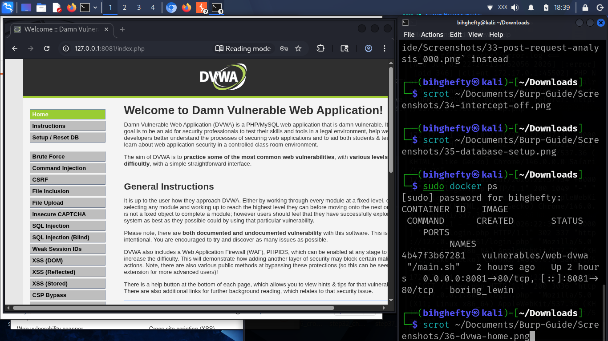{ width=80% }

*DVWA is running and ready for testing. Before beginning the practical lab, verify that you can successfully access the application and log in using your practice credentials.*

---

**Step 2 — Watch HTTP History Grow**

Return to Burp Suite.

Open:

**Proxy → HTTP History**

You'll immediately notice something.

Every page you visited has been recorded.

Without doing anything extra, Burp Suite has quietly documented your browsing session.

That's one of the reasons HTTP History is so valuable.

Even if you forget where a request came from, Burp Suite remembers it for you.

---

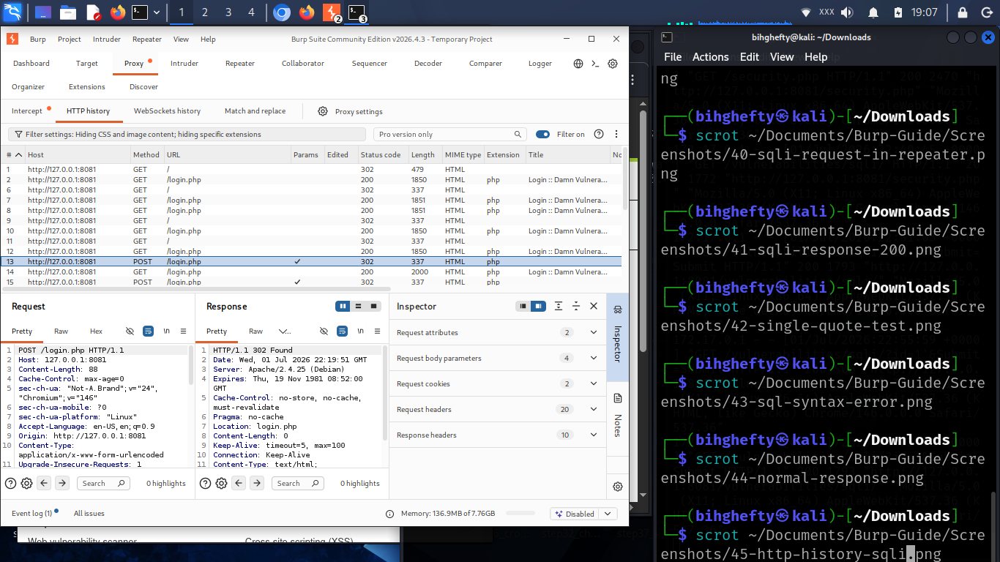{ width=80% }

*Burp Suite automatically records every request and response that passes through the proxy. HTTP History provides a complete record of your browsing activity, making it easy to review requests later.*

---

**Step 3 — Send a Request to Repeater**

Choose one request.

Right-click it.

Select **Send to Repeater**.

Now open the Repeater tab.

Spend a few moments reading the request.

Don't edit anything yet.

Learning to observe is just as important as learning to modify.

---

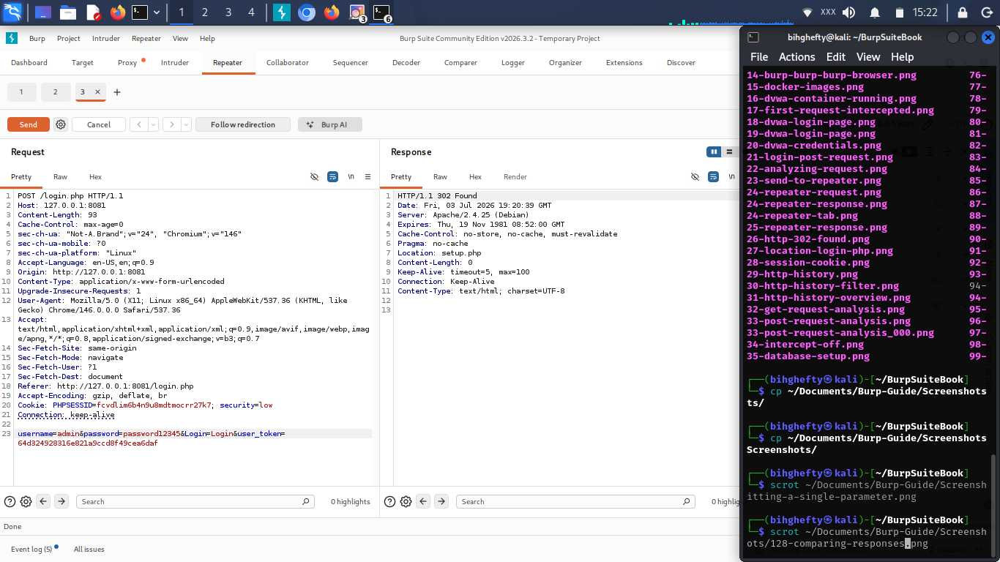{ width=80% }

*The selected request has been copied into the Repeater tool, where it can be edited, resent, and analysed repeatedly without returning to the browser.*

---

**Step 4 — Make One Small Change**

Now edit a single value.

Maybe a parameter.

Maybe a search term.

Maybe part of the URL.

Click **Send**.

Study the response carefully.

Did anything change?

If it did...

Ask yourself why.

That's exactly how security professionals think.

Rather than looking for quick answers, they look for explanations.

---

**Lessons I Learned**

One mistake I made as a beginner was trying to use every Burp Suite tool at the same time.

I'd intercept requests...

send them to Repeater...

open Intruder...

check Decoder...

and compare responses within just a few minutes.

I thought I was making fast progress.

In reality, I was learning very little because I was moving too quickly.

Eventually, I changed my approach.

One request.

One observation.

One lesson.

Ironically, slowing down helped me improve much faster.

That lesson has stayed with me ever since.

---

**Stop and Think**

Imagine trying to understand how a car engine works while driving at full speed.

It would be difficult.

Now imagine stopping the car, opening the bonnet, and examining one component at a time.

That's exactly what Burp Suite allows you to do.

Instead of watching requests disappear in an instant, you can slow everything down and understand what's happening.

---

**Common Beginner Mistakes**

During this exercise, beginners often:

- Click through pages too quickly.
- Ignore the server's response.
- Forget which request they're analysing.
- Try to use multiple Burp Suite tools at once.

My advice is simple.

Slow down.

Understand one request completely before moving on to the next.

Quality always beats speed.

---

**Lab Challenge**

Repeat this exercise tomorrow.

Then repeat it again next week.

Each time, you'll notice details you didn't see before.

That's how practical cybersecurity skills are built.

Not through memorisation...

But through consistent practice.

---

**Looking Ahead**

You've now completed your first complete Burp Suite workflow.

From this point forward, every new concept you learn will build on this foundation.

Take a moment to appreciate how far you've come.

When you first opened Burp Suite, the interface probably looked overwhelming.

Now you know what many of those tools do and, more importantly, why they exist.

That's real progress.

Keep practising.

Stay curious.

Never stop asking why an application behaves the way it does.

Every lab you complete brings you one step closer to thinking like a cybersecurity professional.

— **Henry Uwaezuoke**

# Chapter 15

**From Individual Tools to a Professional Workflow**

I still remember the day Burp Suite finally started making sense to me.

Until then, I had been treating every Burp Suite tab as if it were a separate program.

One minute I was working in **Proxy**.

The next minute I was experimenting with **Repeater**.

Then I jumped into **Decoder** because it looked interesting.

I was learning the tools...

but I wasn't learning the workflow.

One afternoon, after finishing another practice session in DVWA, I closed my laptop and realised something.

Experienced testers don't use Burp Suite because they know every button.

They use it because they follow a process.

That simple realisation changed the way I practised.

Instead of asking,

*"Which Burp Suite tool should I open next?"*

I started asking,

*"What am I trying to understand?"*

Everything became easier after that.

If there's one lesson I hope you take from this chapter, it's this:

**Burp Suite isn't just a collection of tools. It's a complete workflow.**

Once you understand that workflow, every tool begins to make sense.

---

**What You'll Learn**

By the end of this chapter, you'll understand how Burp Suite's tools work together during a typical web application assessment.

You'll learn:

- Why every Burp Suite tool has a different purpose.
- How professional testers move naturally from one tool to another.
- Why understanding the workflow is more valuable than memorising buttons.
- How to begin thinking like a web application security tester.

---

**What Does a Typical Workflow Look Like?**

A professional Burp Suite workflow often follows a simple pattern.

First, browse the application and generate traffic.

Next, capture important requests using **Proxy**.

Review everything that happened in **HTTP History**.

If you discover an interesting request, send it to **Repeater** for closer inspection.

Need to repeat the same request several times?

That's where **Intruder** becomes useful.

If you come across unfamiliar encoded information, open **Decoder**.

Need to compare two responses?

Use **Comparer**.

Want to understand how the entire application is organised?

Open the **Target** tab.

Notice something important.

You don't use every tool during every assessment.

Instead, you choose the right tool for the question you're trying to answer.

That's what makes Burp Suite so powerful.

As you look back over the chapters you've completed, you'll notice that every Burp Suite tool builds on the previous one.

**Proxy** captures the request.

**HTTP History** records it.

**Repeater** allows you to experiment with it.

**Intruder** automates repetitive testing.

**Decoder** helps you understand encoded data.

**Comparer** highlights differences.

And the **Target** tab helps you understand the application's overall structure.

When these tools work together, Burp Suite becomes far more than a collection of features.

It becomes a complete workflow for understanding how web applications behave.

---

**Lessons I Learned**

For a long time, I believed becoming good at Burp Suite meant mastering every feature.

I couldn't have been more wrong.

Real progress came when I stopped trying to learn everything at once.

Instead, I learned to ask simple questions.

*"What is this request doing?"*

*"Why did the response change?"*

*"Which Burp Suite tool will help me answer that question?"*

Those questions completely changed the way I practised.

Eventually, I stopped thinking about tools and started thinking about problems.

Once that happened, Burp Suite became much easier to use.

---

**Henry's Pro Tip**

Don't try to become an expert in every Burp Suite tool overnight.

Become comfortable with the workflow first.

When you understand **why** you're opening a tool, learning **how** to use it becomes much easier.

Always let the problem guide the tool—not the other way around.

---

**Stop and Think**

Imagine you're testing a login page.

Would you immediately launch **Intruder**?

Probably not.

You would first capture the request.

Read it.

Understand it.

Maybe replay it in **Repeater**.

Only after understanding the request would you decide whether automation is necessary.

That's how experienced security testers work.

Understanding always comes before automation.

---

**Common Beginner Mistakes**

When learning Burp Suite, beginners often:

- Jump between tools without understanding why.
- Open Intruder before understanding the original request.
- Ignore HTTP History because they think it's only a log.
- Try to memorise every menu instead of understanding the workflow.

Don't worry if you've done some of these.

Almost everyone does.

The important thing is recognising that Burp Suite works best when its tools work together.

---

**Before We Continue**

Take a few minutes to think back over everything you've learned so far.

Can you explain what each Burp Suite tool is designed to do?

Can you describe when you would use **Proxy** instead of **Repeater**?

Can you explain why **HTTP History** is useful?

If you can answer those questions in your own words, you've already built a strong foundation.

Remember...

The goal isn't memorisation.

The goal is understanding.

---

**Looking Ahead**

From this point onward, we'll move beyond learning individual Burp Suite tools and begin thinking more like professional web application security testers.

You'll learn how to analyse login requests, recognise meaningful patterns, develop better testing habits, and understand how web applications behave.

Everything you've learned so far has been preparing you for the practical chapters ahead.

Now it's time to put those skills together.

---

**A Final Thought**

Take a moment before moving on.

Think back to when you first opened Burp Suite.

The interface probably looked overwhelming.

Today, you know that every tab has a purpose, and more importantly, you understand how those tools work together.

That's real progress.

Never underestimate the value of understanding one concept well before moving to the next.

Cybersecurity isn't a race.

It's a journey built on curiosity, careful observation, and consistent practice.

Every request you capture teaches you something.

Every response you analyse deepens your understanding.

Every lab you complete brings you one step closer to thinking like a professional security tester.

Keep practising.

Stay curious.

And trust the process.

— **Henry Uwaezuoke**

# Chapter 16

**Every Login Tells a Story**

There was a time when a login page looked ordinary to me.

I would type my username.

Enter my password.

Click **Login**.

If the page opened, I moved on without giving it another thought.

Burp Suite completely changed the way I looked at that simple process.

One afternoon, while practising in DVWA, I intercepted a login request for the first time.

For a few seconds, I just stared at it.

There it was...

My browser wasn't performing magic.

It was simply sending an HTTP request to the server.

For the first time, I wasn't looking at a login page.

I was looking at a conversation.

That moment changed the way I understood web applications.

Today, whenever I visit a login page, I don't just see boxes asking for a username and password.

I see data moving between a browser and a web server.

And that's exactly what I want you to see after reading this chapter.

---

**What You'll Learn**

By the end of this chapter, you'll be able to:

- Capture a login request.
- Identify the important parts of the request.
- Understand what your browser sends to the server.
- Read login traffic with confidence.

Don't worry if some of the request looks unfamiliar.

We're learning together, one step at a time.

---

**Before We Touch Burp Suite**

Here's something I wish someone had told me when I was learning.

Don't start by looking for vulnerabilities.

Start by understanding normal behaviour.

If you know what a normal login request looks like, unusual behaviour becomes much easier to recognise later.

That simple habit has helped me countless times.

---

{ width=80% }

*Burp Suite intercepting the HTTP POST login request before it reaches DVWA. This captured request will be analysed and modified in the following exercises.*

---

Before clicking **Login**, pause for a moment.

Ask yourself:

*"What do I think my browser is about to send?"*

Even if your answer isn't perfect, asking the question will help you think more like a security professional.

---

**Capturing the Request**

Turn **Intercept** on.

Enter your username and password.

Click **Login**.

Burp Suite will stop the request before it reaches the server.

Take a slow look at it.

There's no need to rush.

Every line has a purpose.

---

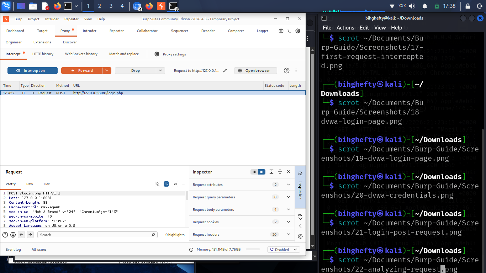{ width=80% }

*Burp Suite intercepts the HTTP POST login request before it reaches the server. The request includes the submitted form data, HTTP headers, cookies, and other information exchanged during authentication.*

---

This is one of the most important screenshots you've seen so far.

Spend a few minutes studying it.

You don't need to understand every header today.

Focus on the bigger picture.

Your browser is having a conversation with the server.

Burp Suite simply allows you to watch that conversation.

---

**From My Lab**

One evening I spent almost fifteen minutes trying to understand why a request looked different from the previous one.

I checked the parameters.

I checked the cookies.

I checked the headers.

Eventually, I realised the only difference was that I had logged out and logged back in again.

The application had issued a new session cookie.

That experience taught me something simple.

Before looking for complicated explanations, always check the basics.

Small details often explain big differences.

---

**Henry's Pro Tip**

When you're learning Burp Suite, don't ask:

*"How do I hack this?"*

Ask:

*"What is this application doing?"*

Curiosity will always take you further than impatience.

The better you understand normal behaviour, the easier it becomes to recognise something unusual later.

---

**Stop and Think**

Close your eyes for a moment.

Imagine your browser writing a letter to the server.

What information would that letter contain?

Now open the intercepted request again.

That's the letter.

You're reading that conversation for yourself.

---

**Common Beginner Mistakes**

One mistake I made early on was trying to understand every header in one sitting.

It was overwhelming.

Eventually, I realised I didn't need to learn everything at once.

I focused on the request line.

Then the parameters.

Then the headers.

Little by little, everything started making sense.

Learning cybersecurity is a marathon, not a sprint.

Take your time.

Progress comes from consistency, not speed.

---

**Lab Challenge**

Repeat this exercise three times.

Each time, write down one thing you noticed that you didn't notice before.

It could be:

- A new header.
- A cookie.
- A parameter.
- Or even the order in which the information appears.

You'll be surprised how much your observation skills improve after just a few practice sessions.

---

**Before You Close Burp Suite**

Take one last look at the login request.

Don't analyse it.

Don't modify it.

Just read it.

Become familiar with it.

The more comfortable you become reading HTTP requests, the more confident you'll become as a cybersecurity professional.

Every expert started exactly where you are today—learning to understand one request at a time.

— **Henry Uwaezuoke**

# Chapter 17

**One Small Change Can Teach You Everything**

When I first started practising with Burp Suite, I made a mistake that many beginners make.

I was so eager to see results that I changed everything at once.

If a request contained five different parameters, I edited all five.

If the server responded differently, I had no idea which change had caused it.

Instead of learning, I was creating confusion for myself.

One afternoon, while practising in DVWA, I decided to slow down.

I changed just one value.

I clicked **Send**.

I studied the response.

Then I changed another value.

For the first time, I could clearly see how the application reacted to each individual change.

That simple exercise taught me one of the most valuable lessons in my cybersecurity journey.

Small changes produce clear lessons.

Big changes often produce confusion.

If you remember only one thing from this chapter, let it be this:

**Change one thing at a time. Observe carefully. Learn continuously.**

---

**What You'll Learn**

By the end of this chapter, you'll be able to:

- Understand why changing one parameter at a time matters.
- Observe how applications respond to different inputs.
- Develop better testing habits.
- Build confidence by learning through careful observation instead of guesswork.

---

**Why Small Changes Matter**

Imagine you're trying to improve a recipe.

If you change the salt, sugar, butter, and flour all at the same time, you'll never know which ingredient made the difference.

Web application testing works exactly the same way.

When you change only one value, the server's response becomes much easier to understand.

That simple habit saves time, reduces confusion, and helps you build a much stronger understanding of how applications behave.

---

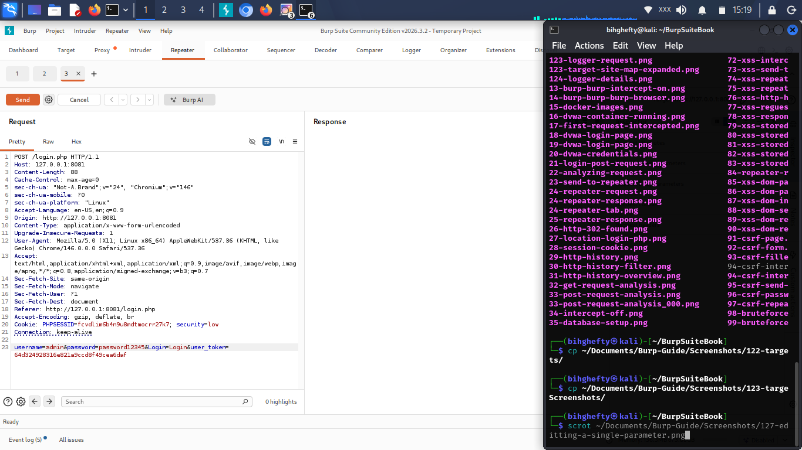{ width=80% }

*A single parameter in the HTTP request is modified inside Burp Suite Repeater before the request is sent. By changing only one value at a time, you can clearly observe how the application responds without introducing unnecessary variables.*

---

Notice that only one value has changed.

Everything else remains exactly the same.

That's intentional.

By limiting your changes, you also limit the number of possible explanations for the server's response.

---

**Try It Yourself**

Open a request in **Repeater**.

Choose one parameter.

Change only that parameter.

Click **Send**.

Now compare the new response with the original one.

Ask yourself:

- What changed?
- What stayed the same?
- Why do I think the application responded this way?

These questions are far more valuable than rushing to find a vulnerability.

You're training yourself to understand how applications behave.

That's the foundation of professional web application testing.

---

{ width=80% }

*After sending the modified request, Burp Suite displays the updated server response. Comparing the original and modified responses helps you understand exactly how a single change affects the application's behaviour.*

---

Take your time.

Don't rush through the comparison.

Sometimes the smallest difference teaches the biggest lesson.

---

**Lessons I Learned**

One evening, I spent almost twenty minutes trying to understand why an application behaved differently after I modified a request.

Eventually, I realised I had accidentally changed two parameters instead of one.

I repeated the exercise, changing only a single value each time.

Everything suddenly became much clearer.

That experience completely changed the way I practise.

Even today, I still remind myself:

**One change.**

**One observation.**

**One lesson.**

That simple habit has taught me far more than rushing through dozens of requests.

---

**Henry's Pro Tip**

Don't measure your progress by how many requests you send.

Measure it by how much you understand from each request.

Good cybersecurity isn't about moving quickly.

It's about learning deeply.

The strongest testers are usually the most patient ones.

---

**Stop and Think**

Before sending your next request, pause for a moment.

Ask yourself:

**"If this response changes, will I know exactly why?"**

If the answer is **no**, simplify your experiment.

Learning becomes much easier when you remove unnecessary variables.

---

**Common Beginner Mistakes**

When practising with Repeater, beginners often:

- Change multiple parameters at once.
- Ignore the original response.
- Rush to the next request without understanding the previous one.
- Assume every different response means they've discovered a vulnerability.

Avoid these habits.

Patience is one of the most valuable skills you'll develop in cybersecurity.

---

**Lab Challenge**

Open three different requests in **Repeater**.

For each request:

- Change only one value.
- Click **Send**.
- Compare the response with the original.
- Write down one thing you observed.

By the end of this exercise, you'll begin noticing patterns that weren't obvious before.

That's how real learning happens.

---

**Before You Close Burp Suite**

Replay one request from the beginning.

This time, don't focus on finding something unusual.

Focus on understanding **why** the application behaves the way it does.

That mindset will serve you far beyond Burp Suite.

The best testers aren't the ones who click the fastest.

They're the ones who observe the most carefully.

---

**Looking Ahead**

You've now seen how a single change can reveal valuable information about an application's behaviour.

In the next chapter, I'll share some of the habits that helped me become a better security tester—habits that had very little to do with memorising tools and everything to do with developing the right mindset.

Sometimes the biggest improvements don't come from learning a new feature.

They come from improving the way you think.

— **Henry Uwaezuoke**

# Chapter 18

**The Habits That Made Me Better**

People sometimes ask me how I became comfortable using Burp Suite.

They're usually expecting me to mention a special course, an expensive certification, or a secret technique.

My answer often surprises them.

It wasn't one big breakthrough.

It was a collection of small habits that I practised every time I opened my lab.

I learned to slow down.

I learned to take notes.

I learned to ask questions before searching for answers.

Most importantly, I learned that becoming better at cybersecurity isn't about knowing everything.

It's about improving a little every day.

Looking back now, I realise those habits helped me far more than any single Burp Suite feature ever did.

That's what I want to share with you in this chapter.

Not shortcuts.

Not secret techniques.

Just the habits that genuinely helped me become a better cybersecurity learner.

---

**What You'll Learn**

By the end of this chapter, you'll understand:

- Why consistency beats intensity.
- How small habits improve your technical skills.
- Why observation is one of a cybersecurity professional's greatest strengths.
- Practical habits you can begin using in your own lab today.

---

**Habit 1: Never Rush Through a Request**

When I first started practising, I thought sending more requests meant I was learning faster.

I couldn't have been more wrong.

Eventually, I realised I learned far more from studying one request carefully than from sending twenty requests without understanding them.

Today, I still pause before clicking **Send**.

I ask myself:

*"What do I expect the application to do?"*

That simple question keeps me focused.

---

**Habit 2: Keep Notes**

One of the best decisions I ever made was keeping a notebook beside my computer.

Whenever I discovered something new, I wrote it down.

Not because I would forget immediately.

Because writing helped me understand it better.

Even today, I still keep notes during practice sessions.

Your future self will thank you for doing the same.

---

{ width=80% }

*Keeping organised notes during your Burp Suite practice sessions helps you record observations, testing steps, and important findings. Good documentation makes it easier to review your progress, repeat successful techniques, and continue improving over time.*

---

**Habit 3: Be Curious**

Curiosity has taught me more than any tool.

Whenever I see something unfamiliar, I don't immediately search for the answer.

First, I ask myself:

*"Why might the application behave this way?"*

Sometimes I'm wrong.

That's okay.

Trying to reason through the problem helps me grow.

Over time, you'll discover that asking good questions is often more valuable than finding quick answers.

---

**From My Lab**

One evening, I spent almost half an hour reading the same HTTP request.

I wasn't testing anything.

I wasn't looking for vulnerabilities.

I was simply trying to understand every line.

At first, it felt slow.

Later, I realised that half hour had taught me more than several rushed practice sessions.

That experience reminded me that understanding always comes before speed.

---

**Henry's Pro Tip**

Don't compare your beginning with someone else's experience.

Every cybersecurity professional started by learning one concept at a time.

Focus on steady progress.

That's what builds confidence.

---

**Stop and Think**

Imagine practising for thirty minutes every day for the next six months.

How much would you improve?

Now imagine waiting for the "perfect time" to start.

Small, consistent effort almost always wins.

---

**Common Beginner Mistakes**

As you continue learning, try to avoid these habits:

- Practising only when you feel motivated.
- Skipping the basics because they seem too simple.
- Copying commands without understanding them.
- Measuring progress by speed instead of understanding.

Remember, confidence grows from understanding, not from rushing.

---

**Lab Challenge**

During your next practice session:

1. Capture one request.
2. Read every line before making any changes.
3. Write down three observations.
4. Modify only one value.
5. Compare the response.

Repeat this exercise until careful observation becomes a habit.

---

**Before You Close Burp Suite**

Before ending today's session, ask yourself one simple question:

**"What did I understand today that I didn't understand yesterday?"**

If you can answer that question, you've made progress.

Progress isn't measured by how much time you spend in Burp Suite.

It's measured by how much you learn while you're there.

---

**Looking Ahead**

The habits you've built so far will help you far beyond Burp Suite.

In the next chapter, we'll learn one of the most valuable skills in web application security—how to read between the lines.

You'll discover that understanding an application's behaviour often depends not only on what you see, but also on what you don't see.

Sometimes the smallest detail reveals the biggest lesson.

— **Henry Uwaezuoke**

# Chapter 19

> **"The application is always communicating. The real question is whether we're paying attention."**
>
> — **Henry Uwaezuoke**

**Reading Between the Lines**

When I first started using Burp Suite, I believed that understanding an HTTP request meant memorising every header and every line.

The more I learned, the more I realised that wasn't true.

One evening, while reviewing the same intercepted request for what felt like the tenth time, I noticed something I had completely overlooked.

It wasn't hidden.

It wasn't encrypted.

It wasn't complicated.

I had simply never slowed down enough to notice it.

That moment changed the way I approached web application testing.

I realised experienced security professionals aren't always seeing different requests.

They're paying closer attention to the same ones.

Since then, I've tried to approach every request with curiosity instead of haste.

Every line is there for a reason.

The challenge is learning to recognise what matters.

That's what this chapter is all about.

---

**What You'll Learn**

By the end of this chapter, you'll be able to:

- Read HTTP requests with greater confidence.
- Identify the most important parts of a request.
- Understand why observation is more valuable than memorisation.
- Build the habit of reading traffic like a security professional.

---

**Looking Beyond the Obvious**

The first time you intercept a request, it can feel overwhelming.

There are headers.

Cookies.

Parameters.

Methods.

Response codes.

It's easy to think you need to understand everything immediately.

You don't.

When I was learning, I stopped trying to master every line at once.

Instead, I asked one simple question:

*"What is this line telling me?"*

One question at a time.

One answer at a time.

Before long, those confusing requests started making sense.

---

{ width=80% }

*Burp Suite intercepting a complete HTTP login request. The lower panel displays the full request sent by the browser, allowing you to examine the request line, headers, cookies, and submitted form data before it reaches the web server.*

---

Take a few minutes to study the request.

Don't rush.

Notice the request method.

Notice the URL.

Notice the headers.

Notice the cookies.

You don't have to understand every detail today.

Just begin noticing what's there.

---

**Reading with Purpose**

A beginner often looks at an HTTP request and sees text.

A security professional sees information.

Instead of asking:

*"What does all this mean?"*

Try asking:

- Who is sending this request?
- Where is it going?
- What information is being sent?
- What response would I expect?

These questions help you think like an analyst instead of simply reading text on a screen.

---

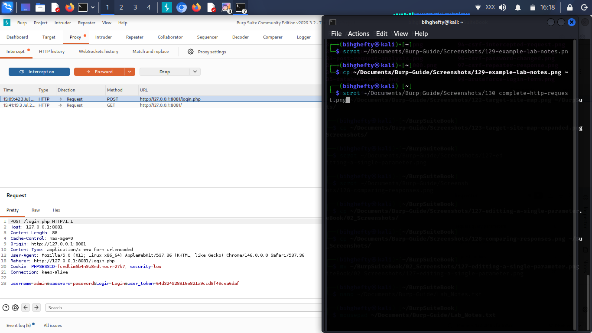{ width=80% }

*Reading the intercepted request inside Burp Suite. By examining the request line, headers, cookies, and request body, you can understand exactly what information the browser is sending to the application.*

---

Focus on understanding the purpose of each section.

You don't need to memorise every header.

Understanding the structure is far more important.

---

**From My Lab**

One evening, I challenged myself to read the same HTTP request five different times.

The first time, I noticed the request method.

The second time, I paid attention to the URL.

The third time, I focused on the cookies.

The fourth time, I studied the headers.

By the fifth reading, I realised something surprising.

The request hadn't changed.

I had.

Each time I looked at it, I understood a little more.

That's when I realised observation is a skill that grows with practice.

— **Henry Uwaezuoke**

---

**Henry's Pro Tip**

Don't try to memorise HTTP.

Read enough requests that HTTP begins to feel familiar.

Confidence comes from repeated exposure, not perfect memory.

---

**Stop and Think**

Open any intercepted request.

Without changing anything, spend two minutes simply reading it.

Ask yourself:

*"If someone handed me this request without Burp Suite, could I explain what the browser is trying to do?"*

If not, that's perfectly okay.

Keep practising.

Every request teaches you something.

---

**Common Beginner Mistakes**

Some beginners:

- Skip over headers because they look confusing.
- Ignore cookies completely.
- Focus only on finding vulnerabilities.
- Rush to modify requests before understanding them.

Avoid those habits.

Understanding always comes before testing.

---

**Lab Challenge**

Capture three different requests.

For each request:

- Identify the request method.
- Identify the requested resource.
- Identify the cookies.
- Identify one header you've never paid attention to before.

Write down one new observation from each request.

Over time, you'll begin recognising patterns without even thinking about them.

---

**Before You Close Burp Suite**

Today's lesson wasn't really about HTTP.

It was about learning to observe.

The more carefully you study normal traffic, the easier it becomes to recognise unusual behaviour later.

Don't worry about understanding everything today.

Focus on understanding one more thing than you understood yesterday.

That's how progress happens.

---

**Looking Ahead**

In the next chapter, we'll shift our attention from reading requests to building the habits that help cybersecurity professionals continue improving over time.

You'll discover that becoming better isn't about learning more tools—it's about learning how to think, observe, and practise more effectively.

Those habits will stay with you long after you've finished this book.

— **Henry Uwaezuoke**

# Chapter 20

> **"The best place to make mistakes is in a lab you built for learning."**
>
> — **Henry Uwaezuoke**

**Building a Safe Practice Lab**

One of the questions I receive most often from beginners is:

*"Where can I practise without getting into trouble?"*

I understand why that question comes up.

When you're excited to learn cybersecurity, it's tempting to point your tools at every website you visit.

I had that excitement too.

Thankfully, I learned an important lesson very early in my journey.

Good cybersecurity professionals don't practise wherever they can.

They practise where they have permission.

That simple principle has guided me throughout my career, and it's one I hope you'll carry with you from the very beginning.

Your lab is more than a collection of virtual machines.

It's your classroom.

It's your workshop.

It's the place where you're free to make mistakes, repeat exercises, and build confidence without worrying about affecting someone else's systems.

If you develop the habit of practising safely today, you'll carry that professionalism into every stage of your cybersecurity career.

---

**What You'll Learn**

By the end of this chapter, you'll be able to:

- Understand why a practice lab is essential.
- Identify safe environments for learning Burp Suite.
- Appreciate the importance of permission in cybersecurity.
- Build habits that prepare you for real-world work.

---

**Why Every Cybersecurity Student Needs a Lab**

Imagine trying to learn to drive without a safe place to practise.

It would be stressful.

You'd spend more time worrying about making mistakes than actually learning.

Cybersecurity is no different.

Your lab gives you the freedom to explore, experiment, and make mistakes in an environment designed for learning.

When you know you're working safely, you're more willing to ask questions, try new ideas, and build confidence.

That's where real learning begins.

---

{ width=80% }

*A safe practice environment consisting of Kali Linux, Burp Suite, and DVWA running locally. Using an isolated lab allows you to practise web application security safely without affecting production systems.*

---

Don't worry if your setup doesn't look exactly like this.

A simple lab that you use consistently is far more valuable than an advanced setup that you rarely open.

---

**Safe Places to Practise**

As your skills grow, you'll discover many excellent platforms designed specifically for learning.

Some of the environments I recommend are:

- DVWA (Damn Vulnerable Web Application)
- OWASP Juice Shop
- PortSwigger Web Security Academy
- Metasploitable

These platforms were created to help people learn safely.

Take advantage of them.

The more time you spend practising in authorised environments, the more confident you'll become.

---

**From My Lab**

I still remember building my first practice lab.

Nothing worked perfectly.

One day the virtual machine refused to boot.

Another day Burp Suite couldn't connect to my browser.

At the time, those problems felt frustrating.

Looking back, I realise I wasn't just learning Burp Suite.

I was learning patience.

I was learning troubleshooting.

I was learning persistence.

Sometimes the biggest lesson isn't in the exercise itself.

Sometimes it's in solving the problem that stopped you from doing the exercise.

— **Henry Uwaezuoke**

---

**Henry's Pro Tip**

Don't wait until your lab is perfect before you begin practising.

Start with what you have.

Improve your lab as your skills improve.

Learning and building can happen at the same time.

---

**Stop and Think**

Ask yourself this question:

**"If I spend just thirty minutes practising every day for the next six months, where could I be?"**

Never underestimate consistent effort.

Small improvements, repeated over time, create remarkable results.

---

**Common Beginner Mistakes**

Avoid these habits:

- Practising on systems without permission.
- Believing expensive equipment is required to learn.
- Giving up when something doesn't work the first time.
- Spending more time collecting tools than learning how to use them.

Your mindset matters far more than your setup.

---

**Lab Challenge**

Before your next study session:

- Start your practice lab.
- Open DVWA.
- Launch Burp Suite.
- Capture one request.
- Write down one new thing you noticed.

Repeat this exercise every time you practise.

Consistency will become one of your greatest strengths.

---

**Before You Close Burp Suite**

Before ending today's session, take a moment to appreciate your progress.

The lab you're building today is preparing you for the work you'll do tomorrow.

Every request you intercept.

Every response you analyse.

Every mistake you fix.

Every lesson you learn.

They're all helping you become a better cybersecurity professional.

Keep learning.

Keep practising.

Keep building.

---

**A Final Thought**

The cybersecurity professionals you admire didn't begin with perfect labs or unlimited knowledge.

They started exactly where you are now—with curiosity, patience, and a willingness to keep learning.

Your lab is more than software running on a computer.

It's where confidence is built.

It's where experience begins.

And one day, you'll look back and realise that the hours you spent practising here became the foundation of your career.

— **Henry Uwaezuoke**

# Chapter 21

> **"Making mistakes isn't the problem. Refusing to learn from them is."**
>
> — **Henry Uwaezuoke**

**Common Beginner Mistakes (and How I Overcame Them)**

When I look back at the beginning of my cybersecurity journey, I smile.

Not because I knew what I was doing.

Because I made almost every beginner mistake you can imagine.

I clicked too quickly.

I skipped documentation.

I rushed through labs.

Sometimes I became so focused on finding vulnerabilities that I forgot to understand how the application actually worked.

Those mistakes felt frustrating at the time.

Today, I'm grateful for them.

Each one taught me something that made me a better learner.

If you're making mistakes while working through this book, don't be discouraged.

You're learning.

The goal isn't to avoid every mistake.

The goal is to avoid making the same mistake over and over again.

---

**What You'll Learn**

By the end of this chapter, you'll be able to:

- Recognise common beginner mistakes.
- Understand why they happen.
- Learn practical ways to avoid them.
- Build healthier learning habits.

---

**Mistake 1: Rushing Through Labs**

One of my biggest mistakes was trying to finish labs as quickly as possible.

I confused speed with progress.

Eventually, I realised something important.

Understanding one exercise completely is worth far more than finishing ten exercises you barely remember.

Slow down.

Your understanding matters more than your pace.

---

**Mistake 2: Depending on Copy and Paste**

There were times when I copied commands without fully understanding what they did.

The command worked.

But I hadn't really learned anything.

Now, whenever I use a command, I ask myself:

*"Do I understand why this works?"*

That simple question has helped me grow far more than copying ever did.

---

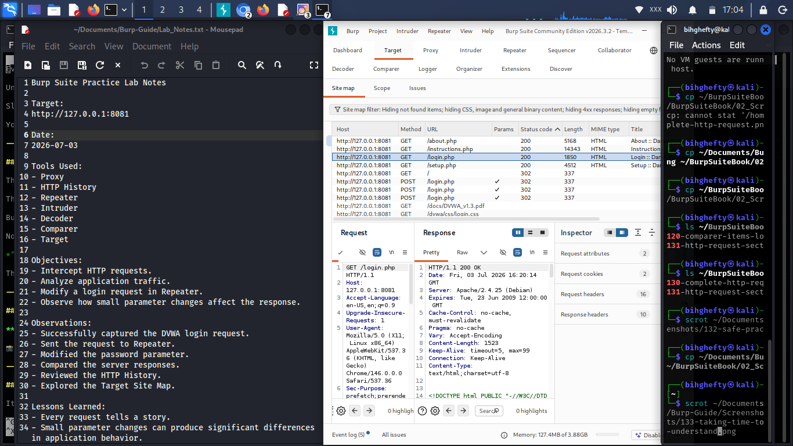{ width=80% }

*Careful observation and note-taking during Burp Suite practice sessions help build a deeper understanding of HTTP requests, responses, and application behaviour. Learning happens through thoughtful analysis, not speed.*

---

**Mistake 3: Ignoring the Basics**

It's tempting to skip the fundamentals because they seem too simple.

I made that mistake too.

Ironically, the more experience I gained, the more I appreciated the basics.

Strong foundations make advanced topics much easier to understand.

Never underestimate the value of mastering the fundamentals.

---

**From My Lab**

One day I spent nearly an hour trying to figure out why something wasn't working.

Eventually, I realised the problem wasn't Burp Suite.

I had overlooked a very small detail in the request.

That experience reminded me that paying attention to the basics often solves problems much faster than chasing complicated explanations.

It's a lesson I still carry into every lab.

---

**Henry's Pro Tip**

Don't be embarrassed by beginner mistakes.

Every experienced cybersecurity professional has made them.

The difference is that they learned from those mistakes instead of giving up.

---

**Stop and Think**

Think about the last mistake you made while practising.

Did it teach you something?

If it did, then it wasn't wasted time.

It was part of your growth.

Every mistake contains a lesson if you're willing to look for it.

---

**Common Beginner Mistakes**

Here are a few habits worth avoiding:

- Rushing through tutorials.
- Ignoring error messages.
- Skipping note-taking.
- Testing without understanding the request.
- Comparing your progress to someone else's.

Focus on becoming a better version of yourself each week.

---

**Lab Challenge**

Go back to one of your earlier Burp Suite exercises.

Repeat it slowly.

As you work, write down three things you understand now that you didn't understand the first time.

You'll probably be surprised by how much you've grown.

That's one of the best ways to measure real progress.

---

**Before You Close Burp Suite**

Mistakes are part of learning.

Don't let them discourage you.

Instead, let them become your teachers.

Every challenge you've overcome so far has made you stronger.

The next challenge will do the same.

Keep practising.

Keep learning.

Keep moving forward.

---

**A Final Thought**

One of the biggest changes in my own journey wasn't becoming someone who never made mistakes.

It was becoming someone who learned from them.

That's a habit I hope you'll develop too.

The goal isn't perfection.

The goal is progress.

Every request you analyse...

Every lab you complete...

Every mistake you correct...

Brings you one step closer to becoming the cybersecurity professional you want to be.

— **Henry Uwaezuoke**

# Chapter 22

> **"A tool doesn't make someone an ethical hacker. Character does."**
>
> — **Henry Uwaezuoke**

**Where Burp Suite Fits into Ethical Hacking**

One of the biggest misconceptions I hear from beginners is this:

*"If I learn Burp Suite, I'll become an ethical hacker."*

I understand why people think that.

Burp Suite is one of the most powerful tools used by penetration testers around the world.

But over the years, I've learned something important.

**Tools don't create professionals. People do.**

Learning how to intercept requests is valuable.

Understanding how web applications work is valuable.

But what truly separates a good ethical hacker is the ability to think carefully, act responsibly, and keep learning.

Burp Suite is one of the tools you'll carry in your toolbox.

It isn't the toolbox itself.

As your cybersecurity journey continues, you'll learn networking, Linux, programming, operating systems, cloud security, and many other skills.

That's why I always encourage beginners to see Burp Suite as a foundation rather than a destination.

---

**What You'll Learn**

By the end of this chapter, you'll understand:

- Where Burp Suite fits within ethical hacking.
- Why technical skills alone aren't enough.
- The importance of ethics and permission.
- The other skills every penetration tester should develop.

---

**Burp Suite Is Part of the Journey**

Imagine a carpenter.

Owning a hammer doesn't make someone a master carpenter.

Learning when and how to use it does.

Burp Suite works the same way.

It helps you inspect, analyse, and test web applications.

But successful ethical hacking also requires knowledge of:

- Linux
- Networking
- HTTP and HTTPS
- Programming fundamentals
- Operating systems
- Web technologies
- Report writing
- Communication skills

The more these skills grow together, the more effective you become.

---

{ width=80% }

*Burp Suite is one component of the ethical hacking workflow. It is primarily used during web application testing to intercept, inspect, modify, and analyse HTTP requests and responses while working alongside other essential cybersecurity skills.*

---

**Ethics Always Comes First**

One lesson I hope every reader remembers is this:

**Permission matters.**

No matter how skilled you become, testing systems without authorisation is wrong.

Professional cybersecurity is built on trust.

Clients trust you to protect their systems.

Employers trust you to act responsibly.

That trust is earned through both technical ability and personal integrity.

Never sacrifice one for the other.

---

**From My Lab**

As I continued learning, I realised something that changed my perspective.

Every new tool I learned made me appreciate the previous one even more.

Networking helped me understand Burp Suite.

Linux helped me troubleshoot problems faster.

Learning HTTP made intercepted requests much easier to read.

It reminded me that cybersecurity isn't about mastering one tool.

It's about connecting many different skills together.

— **Henry Uwaezuoke**

---

**Henry's Pro Tip**

Don't measure your progress by the number of tools you've installed.

Measure it by how well you understand the ones you already use.

Depth will always serve you better than collecting tools you barely know.

---

**Stop and Think**

Imagine someone gives you every cybersecurity tool available today.

Would that automatically make you an expert?

Of course not.

Knowledge grows through study.

Skill grows through practice.

Wisdom grows through experience.

---

**Common Beginner Mistakes**

Some beginners believe:

- Learning one tool is enough.
- Expensive tools create better hackers.
- Technical skills are more important than ethics.
- More tools always mean more knowledge.

Avoid these misunderstandings.

The best cybersecurity professionals never stop learning.

---

**Lab Challenge**

Create a learning roadmap for yourself.

Write down three cybersecurity skills you want to improve after finishing this book.

For example:

- Linux
- Networking
- Python
- OWASP Top 10
- Web application testing

Building a roadmap helps you stay focused on long-term growth.

---

**Before You Close Burp Suite**

Today isn't the end of your learning journey.

It's another important milestone.

Burp Suite has helped you understand how browsers and servers communicate.

Now it's time to keep expanding your knowledge.

Stay curious.

Stay humble.

Keep learning.

Every new skill you develop will strengthen the others and make you a more capable cybersecurity professional.

---

**A Final Thought**

As you close Burp Suite today, remember this:

No tool will ever replace curiosity.

No certification will ever replace integrity.

And no shortcut will ever replace consistent practice.

Keep building your skills one step at a time.

The journey doesn't end here.

In many ways, it's only just beginning.

Thank you for allowing me to be part of your cybersecurity journey.

I hope this book has not only taught you how to use Burp Suite but has also inspired you to keep learning, keep practising, and keep growing.

I'll see you in the next guide.

— **Henry Uwaezuoke**

# Chapter 23

> **"Learning one tool is the beginning of your journey, not the end of it."**
>
> — **Henry Uwaezuoke**

**Your Journey Doesn't End Here**

If you've made it this far, take a moment to appreciate how much you've learned.

When you opened the first chapter of this book, Burp Suite may have looked like a complicated application filled with unfamiliar tabs and technical terms.

Today, you understand much more than the software itself.

You've learned how browsers communicate with servers.

You've learned how HTTP requests and responses work.

You've intercepted traffic, modified requests, analysed responses, and built practical experience that many beginners never take the time to develop.

More importantly, you've begun developing the mindset of a cybersecurity professional.

That's something to be proud of.

But here's something I've learned throughout my own cybersecurity journey.

No single tool will ever define your career.

Burp Suite is one of the most important tools for web application security, but it's only one piece of a much larger picture.

The skills you've developed while working through this book—patience, observation, curiosity, and consistency—will continue serving you long after you've closed Burp Suite.

Those qualities matter far more than any single tool you'll ever learn.

---

**What Comes Next?**

One of the questions readers often ask me is,

*"What should I learn after Burp Suite?"*

My answer is always the same.

Keep building your foundation.

Spend time improving your Linux skills.

Strengthen your networking knowledge.

Learn basic Python scripting.

Study the OWASP Top 10 in greater detail.

Build a home lab where you can practise regularly.

Most importantly, keep challenging yourself with real-world exercises.

Cybersecurity isn't a destination.

It's a lifelong journey of learning.

---

{ width=80% }

*Burp Suite is an excellent starting point, but it is only one step in your cybersecurity journey. Continue building your skills in Linux, networking, Python, web security, and practical lab work to become a well-rounded cybersecurity professional.*

---

**From My Lab**

One thing I've noticed throughout my career is that every new skill makes the previous one more valuable.

Learning Linux made Burp Suite easier to use.

Understanding networking helped me analyse web traffic with greater confidence.

Learning scripting allowed me to automate repetitive tasks.

Nothing I learned was wasted.

Each skill became another building block.

That's why I encourage every beginner to keep learning, even after finishing this book.

The journey only becomes more rewarding from here.

---

**Henry's Pro Tip**

Don't rush to learn every cybersecurity tool you hear about.

Master one.

Practise it.

Understand it.

Then move on to the next.

Depth will always be more valuable than collecting tools you barely know how to use.

---

**Stop and Think**

Take a notebook and answer these questions:

- Which chapter taught me the most?
- Which topic do I still want to practise?
- What skill do I want to learn next?

Your answers will help shape your personal learning roadmap.

---

**Lab Challenge**

Create a six-month learning plan.

Include:

- Linux practice
- Networking review
- Python basics
- Burp Suite labs
- OWASP Top 10 study
- Portfolio projects

Review your plan every month and update it as your skills grow.

Small, consistent progress will take you much further than occasional bursts of motivation.

---

**Before the Final Chapter**

You've completed the technical journey this book was designed to take you through.

You've built a solid foundation in Burp Suite.

But before we close this book together, I'd like to share one final message with you.

It's not about Burp Suite.

It's not about tools.

It's about you, your future, and the kind of cybersecurity professional you're becoming.

I'll meet you there.

— **Henry Uwaezuoke**

# Chapter 24

> **"Your greatest investment will never be the tools you own. It will always be the knowledge you build."**
>
> — **Henry Uwaezuoke**

**A Letter to Every Future Cybersecurity Professional**

Dear Reader,

By the time you're reading this page, you've reached the end of this book.

More importantly, you've reached the beginning of something much bigger.

I don't know your background.

I don't know where you're reading this book from.

You may be a student.

You may be changing careers.

You may simply be curious about cybersecurity.

Wherever you're starting from, I want you to know this:

**Your beginning matters.**

When I started learning cybersecurity, there were moments when I felt overwhelmed.

Some concepts seemed impossible.

Some tools looked far too complicated.

There were days when I wondered whether I was making any real progress at all.

Looking back today, I realise those difficult days shaped me far more than the easy ones.

Every challenge taught me patience.

Every mistake taught me something valuable.

Every small victory gave me the confidence to keep going.

That's why I want to encourage you today.

Don't measure yourself against someone who has been learning for ten years.

Measure yourself against the person you were yesterday.

If you've learned one new concept...

If you've understood one new command...

If you've become just a little more confident...

Then you're moving forward.

And that's something to be proud of.

---

**Cybersecurity Needs People Like You**

The world doesn't just need skilled cybersecurity professionals.

It needs people who are curious.

People who are ethical.

People who never stop learning.

Technology will continue to change.

New vulnerabilities will appear.

New attack techniques will emerge.

But one thing will always remain valuable:

A person who is willing to keep learning.

Never lose that curiosity.

It's one of the greatest strengths you'll ever have.

---

**From My Heart**

Writing this book has reminded me why I love teaching.

Not because I have all the answers.

But because I remember what it felt like to search for them.

If something in these pages helped you understand Burp Suite a little better...

If it encouraged you to keep learning...

If it gave you the confidence to believe in yourself...

Then this book has achieved its purpose.

Thank you for allowing me to be part of your journey.

It's an honour I don't take lightly.

---

**Henry's Final Advice**

Never stop building.

Never stop reading.

Never stop practising.

The cybersecurity community grows stronger every time someone chooses to learn instead of giving up.

One day, someone will ask you the same questions you once asked.

When that day comes...

Teach them.

Encourage them.

Help them grow.

Knowledge becomes even more valuable when it's shared.

That's how we build a stronger cybersecurity community together.

---

**Before We Say Goodbye**

This may be the final page of this book.

But I sincerely hope it isn't the final page of our journey together.

I'll continue writing practical cybersecurity books.

I'll continue sharing what I learn.

And I hope you'll continue learning alongside me.

Until then...

Keep your curiosity alive.

Keep your integrity strong.

Keep practising.

Keep improving, one day at a time.

The future belongs to those who refuse to stop learning.

Thank you for trusting me to guide you through your first Burp Suite journey.

I truly hope this book becomes one of the stepping stones toward the cybersecurity career you dream of.

I'll see you again in the next book.

Until then...

Stay focused.

Stay ethical.

Keep building.

— **Henry Uwaezuoke**

**Learn. Practice. Secure.**

--------------------------------

# Thank You

Thank you for taking the time to read this book.

I truly hope it has helped you understand Burp Suite, build confidence in web application security, and take another step toward your cybersecurity goals.

If you found this guide helpful, I'd really appreciate it if you could leave an honest review on Amazon.

Your feedback not only helps me improve future books, but it also helps other aspiring cybersecurity professionals discover this guide.

Every review, no matter how short, makes a difference.

If you'd like to continue learning with me, keep an eye out for my upcoming cybersecurity books covering Linux, Nmap, web application security, SOC analysis, penetration testing, and many more practical topics.

You can also connect with me here:

GitHub:
https://github.com/bihghefty

LinkedIn:
https://www.linkedin.com/in/henry-uwaezuoke-34681b411

Thank you once again for allowing me to be part of your cybersecurity journey.

I wish you success in your studies, your labs, and your future career.

I'll see you in the next book.

— **Henry Uwaezuoke**

**Learn. Practice. Secure.**
